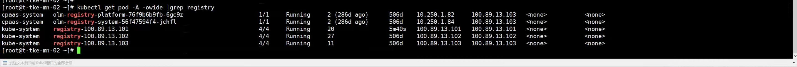
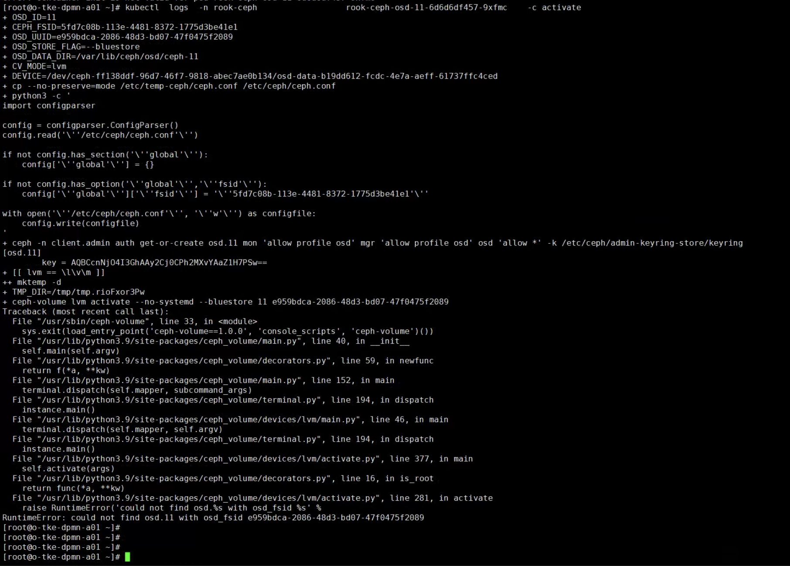

---
kind:
  - Troubleshooting
products:
  - Alauda Container Platform
  - Alauda DevOps
  - Alauda AI
  - Alauda Application Services
  - Alauda Service Mesh
  - Alauda Developer Portal
ProductsVersion:
  - 4.1.0,4.2.x
---
<!-- A type of document that involves encountering a fault, diagnosing it, performing root cause analysis, and providing solutions. -->

# 平台巡检有异常告警

registry pod异常卡在init chi-pxc-ck pod异常 discover-device pod因OOM异常终止

## Cause
- 退出的容器占用了端口
- PVC存储已满
- 内存资源限制过低（默认128m）
- 磁盘故障导致pvs和fsType异常

## Resolution
- 清理占用端口的已退出容器
- 扩容PVC存储容量
- 调整内存资源限制至256m
- 将故障磁盘从集群中移除并重新添加

## [workaround]

## [Related Information]
**Screenshots**

- Environment: 3.14.2
- registry pod
- 端口占用
- chi-pxc-ck pod
- PVC配置
- discover-device pod
- 内存资源限制
- ceph osd-11
- pvs
- fsType配置
- Component: 监控告警通知巡检
- Page ID: 324174605
- Original Title: 基础架构-运维中心-监控告警通知巡检-平台巡检有异常告警-113551
