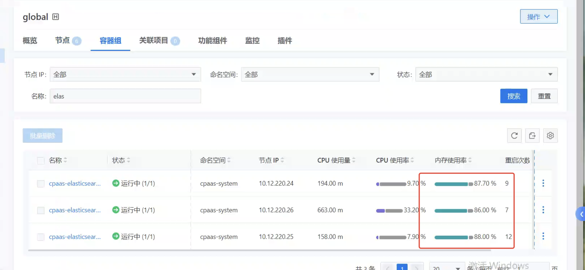
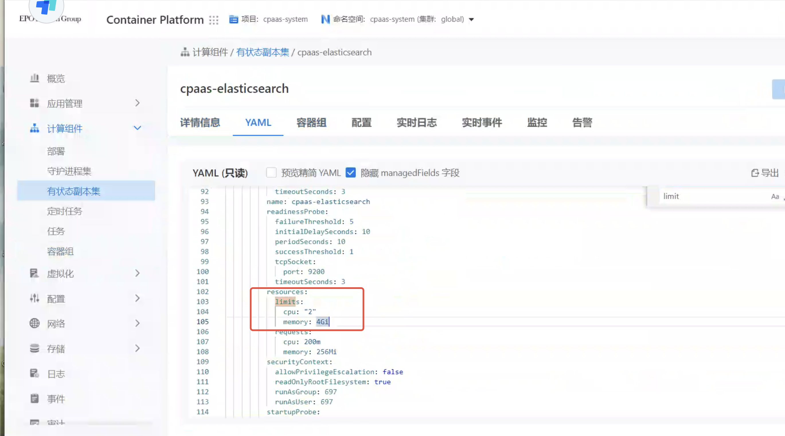
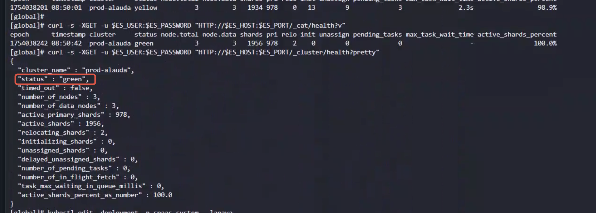

---
kind:
  - Troubleshooting
products:
  - Alauda Container Platform
  - Alauda DevOps
  - Alauda AI
  - Alauda Application Services
  - Alauda Service Mesh
  - Alauda Developer Portal
ProductsVersion:
  - 4.1.0,4.2.x
---
<!-- A type of document that involves encountering a fault, diagnosing it, performing root cause analysis, and providing solutions. -->

# 运维中心 / 告警 / 实时告警，有4个告警帮忙处理一下。

kube-ovn-cni告警 es内存使用率高导致容器重启 kafka堆积告警频繁

## Cause
- kube-ovn-cni组件异常
- es内存资源不足
- kafka堆积告警阈值设置过低（0）

## Resolution
- 重启region-ns/region-hp集群的kube-ovn-cni相关pod
- global集群es内存扩容至8G并重新分片
- 调整kafka堆积告警阈值为100或200

## [workaround]

## [Related Information]
**Screenshots**

- Environment: 3.18.1版本，涉及region-ns/region-hp集群及global集群
- kube-ovn-cni
- es集群
- kafka
- 告警阈值配置
- Component: 监控告警通知巡检
- Page ID: 327812336
- Original Title: 基础架构-运维中心-监控告警通知巡检-运维中心 / 告警 / 实时告警，有4个告警帮忙处理一下。-114235
