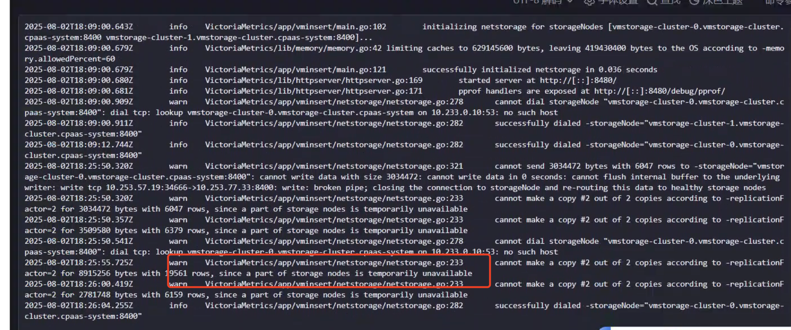

---
kind:
  - Troubleshooting
products:
  - Alauda Container Platform
  - Alauda DevOps
  - Alauda AI
  - Alauda Application Services
  - Alauda Service Mesh
  - Alauda Developer Portal
ProductsVersion:
  - 4.1.0,4.2.x
---
<!-- A type of document that involves encountering a fault, diagnosing it, performing root cause analysis, and providing solutions. -->

# 业务集群监控异常，相关容器都running

业务集群监控异常 相关容器都处于running状态 vminsert-cluster日志报错部分存储节点暂时不可用

## Cause
- 数据插件异常导致存储节点不可用

## Resolution
- 重启数据插件

## [workaround]

## [Related Information]
**Screenshots**

- Environment: 4.0.1
- vminsert-cluster
- 存储节点
- 数据插件
- Component: 监控告警通知巡检
- Page ID: 327812369
- Original Title: 基础架构-运维中心-监控告警通知巡检-业务集群监控异常，相关容器都running-114514
