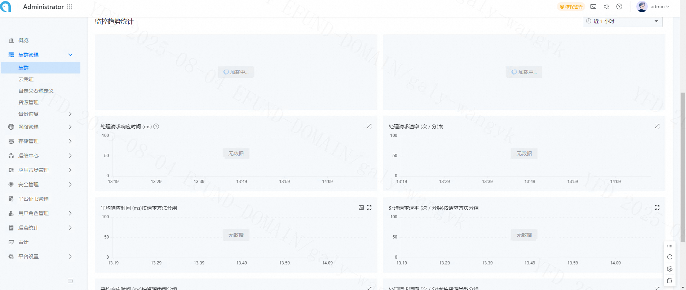
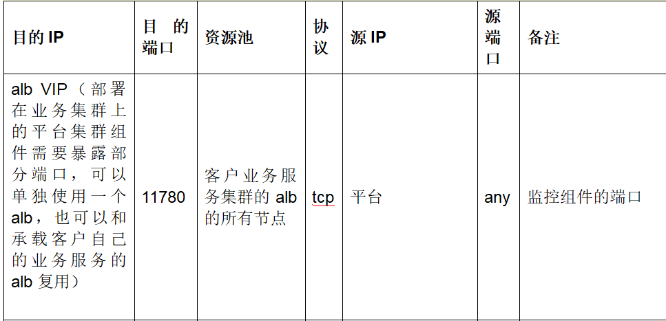

---
kind:
  - Troubleshooting
products:
  - Alauda Container Platform
  - Alauda DevOps
  - Alauda AI
  - Alauda Application Services
  - Alauda Service Mesh
  - Alauda Developer Portal
ProductsVersion:
  - 4.1.0,4.2.x
---
<!-- A type of document that involves encountering a fault, diagnosing it, performing root cause analysis, and providing solutions. -->

# 纳管的ack集群，在监控面板看不到数据

监控面板看不到数据 未触发告警

## Cause
- 容器网络到vm存储集群vip:11780端口不通

## Resolution
- 开通业务集群监控组件容器网络到vm存储集群vip:11780端口转发

## [workaround]

## [Related Information]
**Screenshots**

监控相关的网络端口为11780
- Environment: ACK集群
- 11780
- vm存储集群vip
- 容器网络配置
- Component: 监控告警通知巡检
- Page ID: 330465770
- Original Title: 基础架构-运维中心-监控告警通知巡检-纳管的ack集群，在监控面板看不到数据-114316
