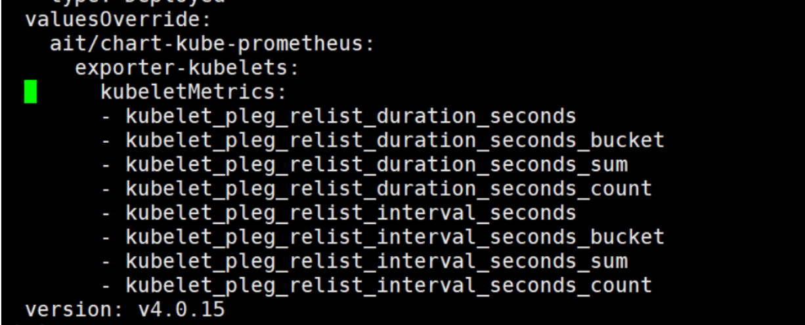

---
kind:
  - Troubleshooting
products:
  - Alauda Container Platform
  - Alauda DevOps
  - Alauda AI
  - Alauda Application Services
  - Alauda Service Mesh
  - Alauda Developer Portal
ProductsVersion:
  - 4.1.0,4.2.x
---
<!-- A type of document that involves encountering a fault, diagnosing it, performing root cause analysis, and providing solutions. -->

# 修改minfo增加原生监控指标后，未成功获取目标指标数据

kubelet组件的kubelet_pleg_relist_duration_seconds_bucket指标未采集到数据 通过metrics接口直接获取该指标存在数据 apiserver/kube-scheduler组件指标采集正常

## Cause
- kubelet的additionalKeepMetrics功能实现存在缺陷

## Resolution
- 将需要采集的指标追加到kubeletMetrics列表8行之后位置

## [workaround]
- 保持原有指标不变，在kubeletMetrics配置中按以下格式追加新指标：
kubeletMetrics:
* kubelet_volume_stats_capacity_bytes
* kubelet_volume_stats_available_bytes
* kubelet_volume_stats_used_bytes
* kubelet_volume_stats_inodes
* kubelet_volume_stats_inodes_free
* kubelet_volume_stats_inodes_used

## [Related Information]
**Screenshots**

- Environment: 3.16.2
- kubelet
- additionalKeepMetrics
- kubeletMetrics
- metrics接口
- Component: 监控告警通知巡检
- Page ID: 330466120
- Original Title: 基础架构-运维中心-监控告警通知巡检-修改minfo增加原生监控指标后，未成功获取目标指标数据-114997
