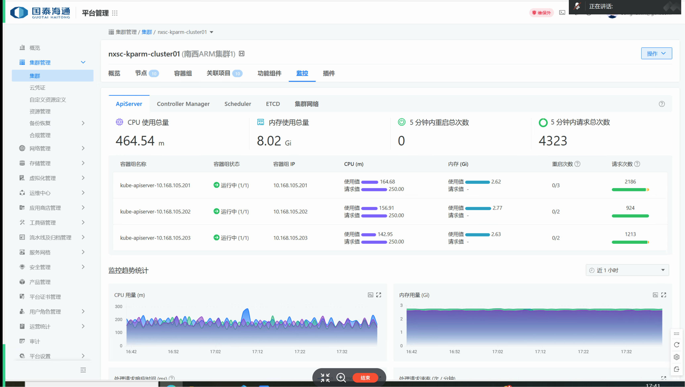
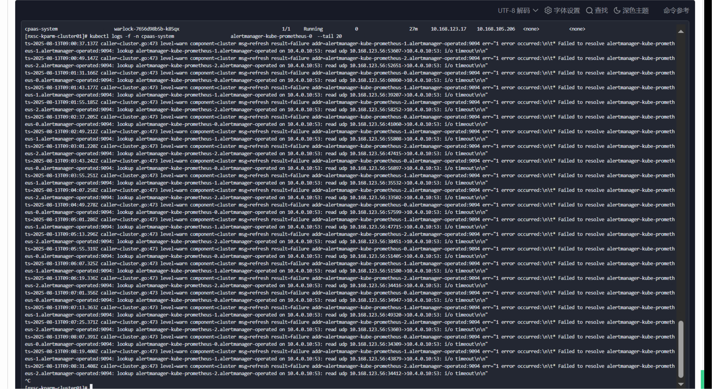
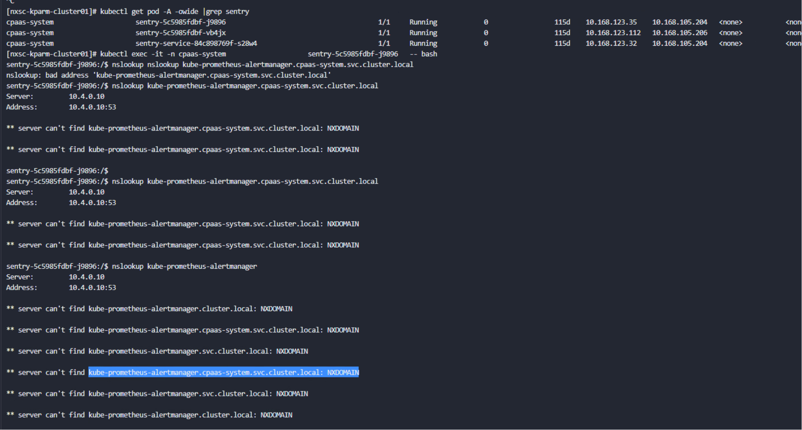

---
kind:
  - Troubleshooting
products:
  - Alauda Container Platform
  - Alauda DevOps
  - Alauda AI
  - Alauda Application Services
  - Alauda Service Mesh
  - Alauda Developer Portal
ProductsVersion:
  - 4.1.0,4.2.x
---
<!-- A type of document that involves encountering a fault, diagnosing it, performing root cause analysis, and providing solutions. -->

# 集群监控信息为空

集群监控信息为空 Prometheus未采集ServiceMonitor数据 日志中存在解析错误

## Cause
- coredns与apiserver失联
- 可能由etcd历史回滚引发

## Resolution
- 重启coredns pod

## [workaround]

## [Related Information]
**Screenshots**

- Environment: 3.14.2
- Prometheus
- ServiceMonitor
- coredns
- apiserver
- etcd
- Component: 监控告警通知巡检
- Page ID: 333316485
- Original Title: 基础架构-运维中心-监控告警通知巡检-集群监控信息为空-115075
