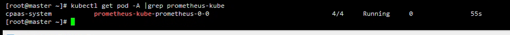

---
kind:
  - Troubleshooting
products:
  - Alauda Container Platform
  - Alauda DevOps
  - Alauda AI
  - Alauda Application Services
  - Alauda Service Mesh
  - Alauda Developer Portal
ProductsVersion:
  - 4.1.0,4.2.x
---
<!-- A type of document that involves encountering a fault, diagnosing it, performing root cause analysis, and providing solutions. -->

# 监控组件异常

prometheus容器不断重启，退出码137 opening storage failed: lock DB directory: resource temporarily unavailable 日志数据损坏

## Cause
- 资源不足导致容器OOMKilled
- wal数据损坏导致启动失败
- 文件锁残留导致资源争用

## Resolution
- 扩容prometheus资源至4c12g
- 删除文件锁：rm -rf /cpaas/monitoring/prometheus/prometheus-db/lock
- 清理wal目录数据：rm -rf /cpaas/monitoring/prometheus/prometheus-db/wal/*

## [workaround]

## [Related Information]
**Screenshots**

2.将prometheus容器资源扩至4c12g（kubectl edit prometheus -n cpaas-system kube-prometheus-0 ）后，prometheus容器状态仍异常，describe报错opening storage failed: lock DB directory: resource temporarily unavailable

- Environment: v3.14.1 | 集群dongda | 命名空间cpaas-system | 组件prometheus-kube-prometheus-0
- /cpaas/monitor
- /cpaas/monitoring/prometheus/prometheus-db
- prometheus-kube-prometheus-0
- wal目录
- Component: 监控告警通知巡检
- Page ID: 336823019
- Original Title: 基础架构-运维中心-监控告警通知巡检-监控组件异常-116392
