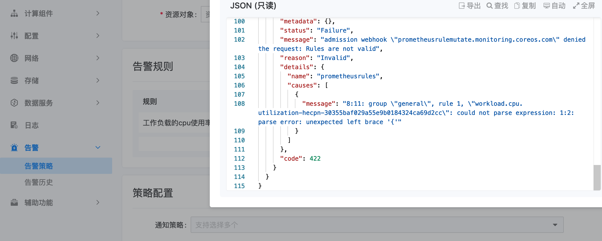

---
kind:
  - Troubleshooting
products:
  - Alauda Container Platform
  - Alauda DevOps
  - Alauda AI
  - Alauda Application Services
  - Alauda Service Mesh
  - Alauda Developer Portal
ProductsVersion:
  - 4.1.0,4.2.x
---
<!-- A type of document that involves encountering a fault, diagnosing it, performing root cause analysis, and providing solutions. -->

# 创建告警规则报错，错误码422

创建告警规则报错422 错误信息提示表达式解析错误：unexpected left brace '{'

## Cause
- prometheus-operator组件状态异常

## Resolution
- 重启prometheus-operator容器

## [workaround]

## [Related Information]
**Screenshots**

- Environment: 3.8.1
- prometheus-operator
- Component: Alerting
- Page ID: 119081392
- Original Title: 创建告警规则报错，错误码422
