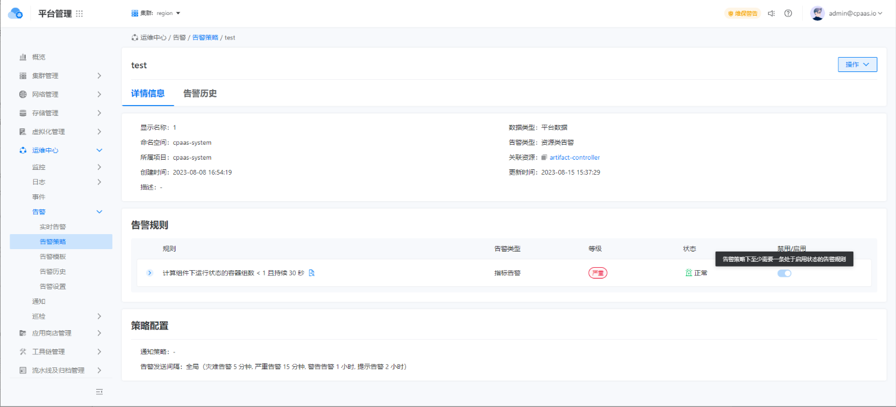

---
kind:
  - Troubleshooting
products:
  - Alauda Container Platform
  - Alauda DevOps
  - Alauda AI
  - Alauda Application Services
  - Alauda Service Mesh
  - Alauda Developer Portal
ProductsVersion:
  - 4.1.0,4.2.x
---
<!-- A type of document that involves encountering a fault, diagnosing it, performing root cause analysis, and providing solutions. -->

# ACP告警策略至少要启用一条告警规则

创建告警策略时必须至少启用一条告警规则 删除最后一条告警规则时报错

## Cause
- 平台逻辑强制要求告警策略必须包含至少一条生效的告警规则

## Resolution
- 删除不含告警规则的策略
- 对策略进行静默处理

## [workaround]

## [Related Information]
**Screenshots**
1、（3.12平台版本明确说明）
2、（3.8版本当删除最后一条告警规则时，报错。）
- Environment: 3.6+版本(已验证3.8/3.12)
- 告警策略
- 告警规则
- Component: Alerting
- Page ID: 161386646
- Original Title: ACP告警策略至少要启用一条告警规则
