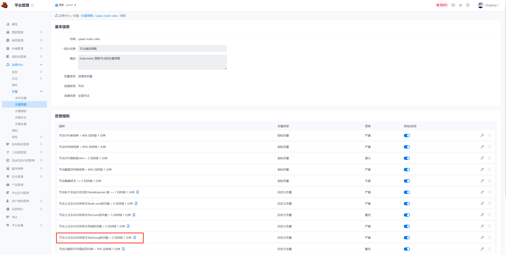
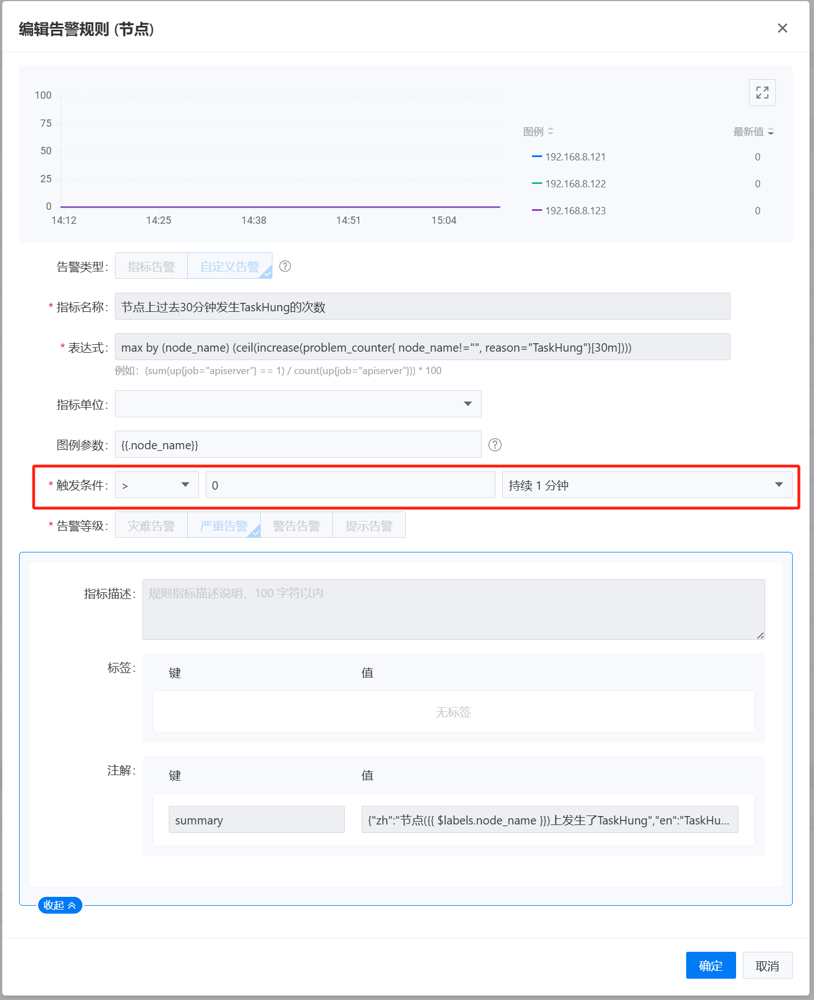
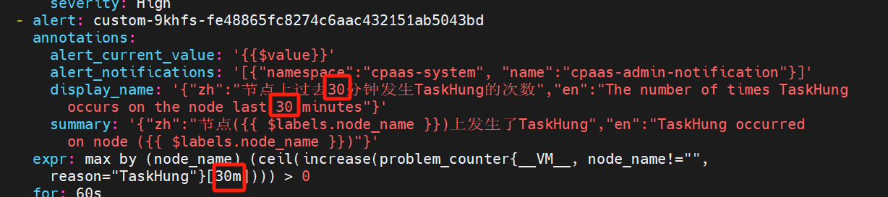

---
kind:
  - Troubleshooting
products:
  - Alauda Container Platform
  - Alauda DevOps
  - Alauda AI
  - Alauda Application Services
  - Alauda Service Mesh
  - Alauda Developer Portal
ProductsVersion:
  - 4.1.0,4.2.x
---
<!-- A type of document that involves encountering a fault, diagnosing it, performing root cause analysis, and providing solutions. -->

# 修改平台默认的告警规则

无法在界面直接修改告警策略的表达式，只能修改告警触发条件

## Cause

## Resolution
- 在对应集群的master节点执行命令 kubectl edit alertrules.ait.alauda.io -n cpaas-system cpaas-node-rules 修改YAML配置

## [workaround]

## [Related Information]
**Screenshots**

- Environment: 3.16
- alertrules.ait.alauda.io
- cpaas-system
- cpaas-node-rules
- Component: Alerting
- Page ID: 242092924
- Original Title: 修改平台默认的告警规则
