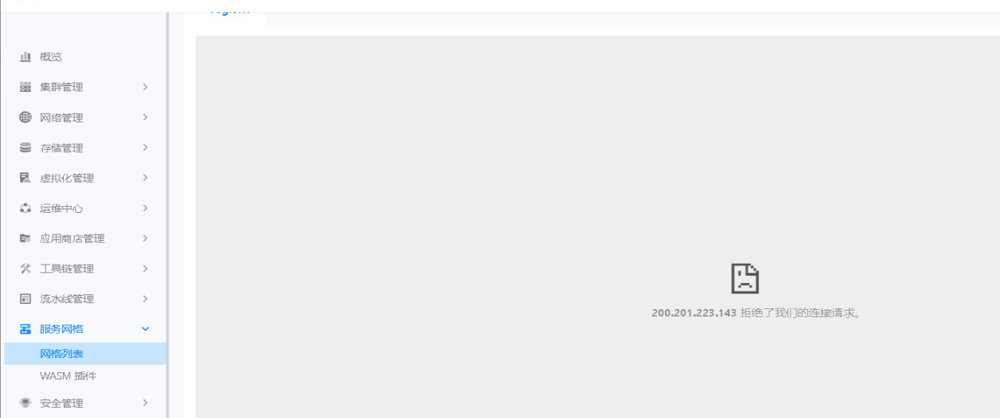
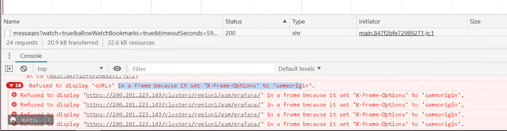
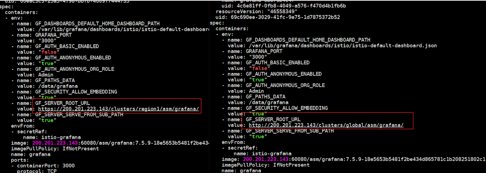

---
kind:
  - Troubleshooting
products:
  - Alauda Container Platform
  - Alauda DevOps
  - Alauda AI
  - Alauda Application Services
  - Alauda Service Mesh
  - Alauda Developer Portal
ProductsVersion:
  - 4.1.0,4.2.x
---
<!-- A type of document that involves encountering a fault, diagnosing it, performing root cause analysis, and providing solutions. -->

# asm业务集群监控显示连接拒绝

监控无法显示，报错拒绝连接 请求头报错 grafana环境变量协议不一致

## Cause
- grafana配置的访问地址为https协议，平台使用http协议访问

## Resolution
- kubectl edit ClusterConfig asm-cluster-config 修改grafanaURL

## [workaround]

## [Related Information]
**Screenshots**

- Environment: 3.8.1
- ClusterConfig
- grafanaURL
- istio-system
- grafana
- Component: Grafana
- Page ID: 115535741
- Original Title: asm业务集群监控显示连接拒绝
