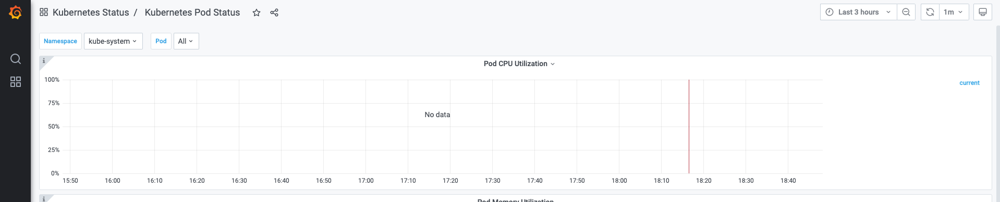
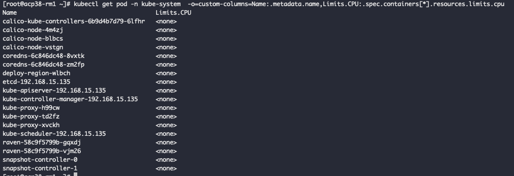

---
kind:
  - Troubleshooting
products:
  - Alauda Container Platform
  - Alauda DevOps
  - Alauda AI
  - Alauda Application Services
  - Alauda Service Mesh
  - Alauda Developer Portal
ProductsVersion:
  - 4.1.0,4.2.x
---
<!-- A type of document that involves encountering a fault, diagnosing it, performing root cause analysis, and providing solutions. -->

# grafana的pod监控页无法显示kube

grafana的pod监控页无法显示kube-system下的cpu使用率 prometheus查询container_spec_cpu_quota无记录

## Cause
- kube-system下的容器未设置cpu限制值，导致container_spec_cpu_quota无数据

## Resolution
- 为kube-system下的pod配置resources.limits.cpu值

## [workaround]

## [Related Information]
**Screenshots**

- Environment: 通用
- container_cpu_usage_seconds_total_irate5m
- container_spec_cpu_quota
- kubectl get pod -n kube-system -o=custom-columns=Name:.metadata.name,Limits.CPU:.spec.containers[*].resources.limits.cpu
- resources.limits.cpu
- Component: Grafana
- Page ID: 120096820
- Original Title: grafana的pod监控页无法显示kube-system下的cpu使用率
