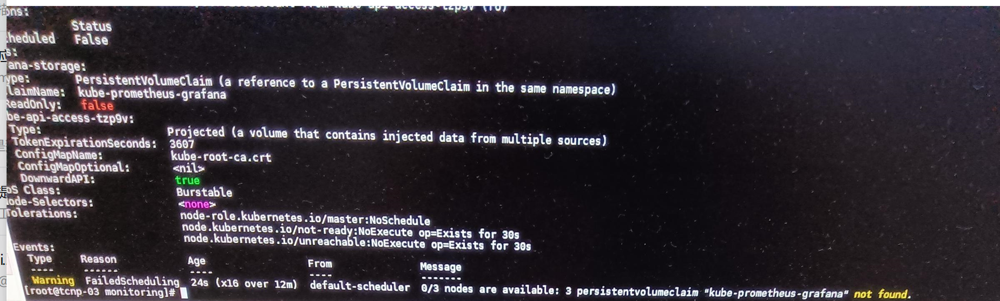
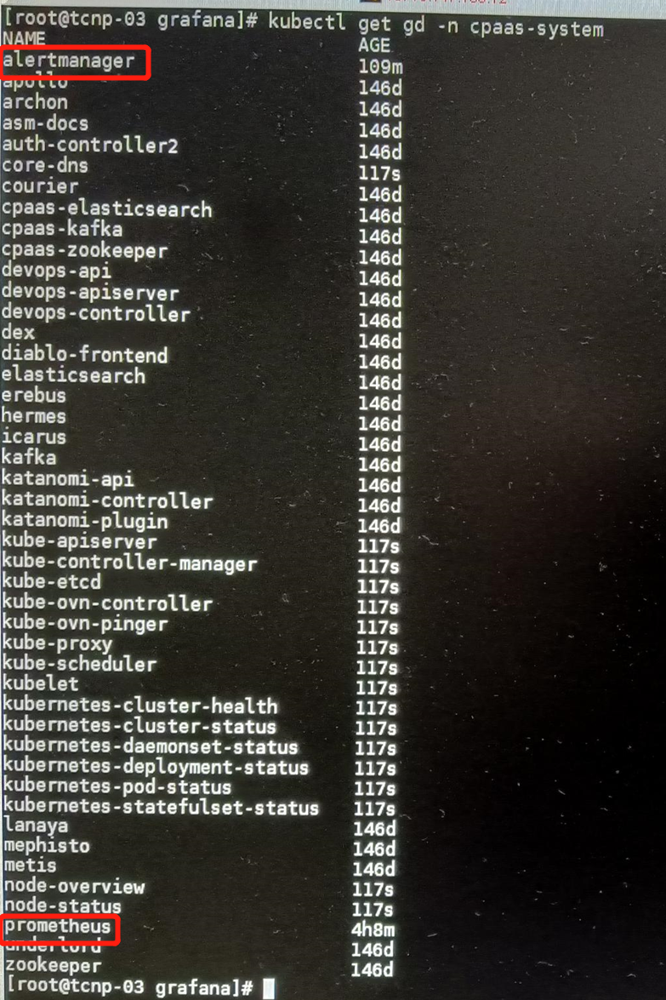
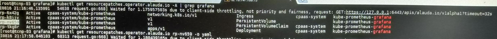

---
kind:
  - Troubleshooting
products:
  - Alauda Container Platform
  - Alauda DevOps
  - Alauda AI
  - Alauda Application Services
  - Alauda Service Mesh
  - Alauda Developer Portal
ProductsVersion:
  - 4.1.0,4.2.x
---
<!-- A type of document that involves encountering a fault, diagnosing it, performing root cause analysis, and providing solutions. -->

# 3.6.2

grafana服务pvc无法创建完成

## Cause
- 历史版本在渲染模板时执行了额外的删除动作，与3.6上的ResourcePatch冲突导致部分资源未清理干净

## Resolution
- 界面点击卸载当前集群监控组件
- 清理监控所在节点/cpaas/monitoring/目录下alert、prometheus、grafana三个目录
- kubectl get gd -ncpaas-system
- kubeclt delete gd -ncpaas-system "删除prometheus相关内容"
- kubectl get resourcepatches.operator.alauda.io -ncpaas-system
- kubeclt delete resourcepatches.operator.alauda.io -ncpaas-system "删除prometheus相关内容"
- 界面重新进行监控部署

## [workaround]

## [Related Information]
**Screenshots**

- Environment: 3.6.2
- gd
- resourcepatches.operator.alauda.io
- /cpaas/monitoring/alert
- /cpaas/monitoring/prometheus
- /cpaas/monitoring/grafana
- Component: Grafana
- Page ID: 123603117
- Original Title: 3.6.2-监控-监控组件卸载后重新部署grafana服务pvc无法创建完成
