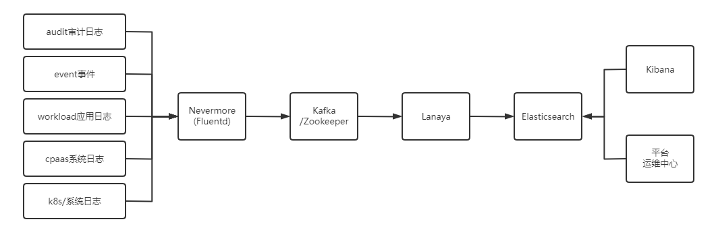

---
kind:
  - Troubleshooting
products:
  - Alauda Container Platform
  - Alauda DevOps
  - Alauda AI
  - Alauda Application Services
  - Alauda Service Mesh
  - Alauda Developer Portal
ProductsVersion:
  - 4.1.0,4.2.x
---
<!-- A type of document that involves encountering a fault, diagnosing it, performing root cause analysis, and providing solutions. -->

# 日志

日志加载延迟无法查看到近15分钟日志，需要调整到较大时间才能进行日志加载

## Cause
- kafka数据堆积
- es节点磁盘写入阻塞
- 磁盘iops或吞吐量不足
- es节点cpu或内存资源瓶颈

## Resolution
- 更换高性能ssd存储
- 根据部署文档调整日志组件配置

## [workaround]
- 调整查询时间范围到较大区间

## [Related Information]
**Screenshots**

- Environment: 3.6.*,3.4.*,3.0.*
- kafka-svc:9308/metrics
- kibana Dev Tools
- /_nodes/stats/thread_pool
- lanaya
- nevermore
- apollo
- esCostTime
- --v=1
- Component: Grafana
- Page ID: 124684400
- Original Title: 日志-平台日志查询分析功能-日志加载延迟无法查询近15分钟日志，需要调整到较大时间才能进行日志加载
