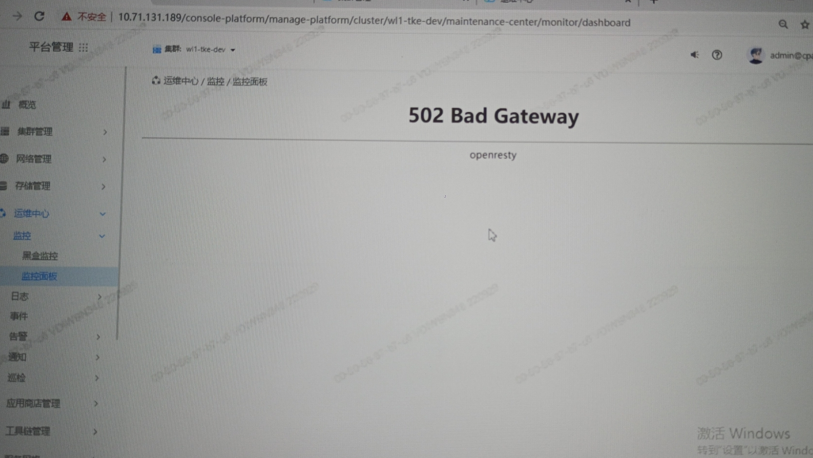
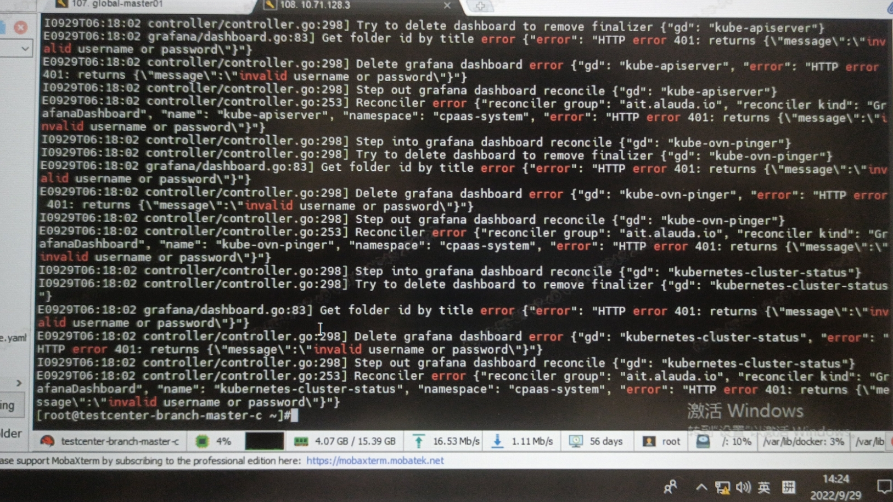
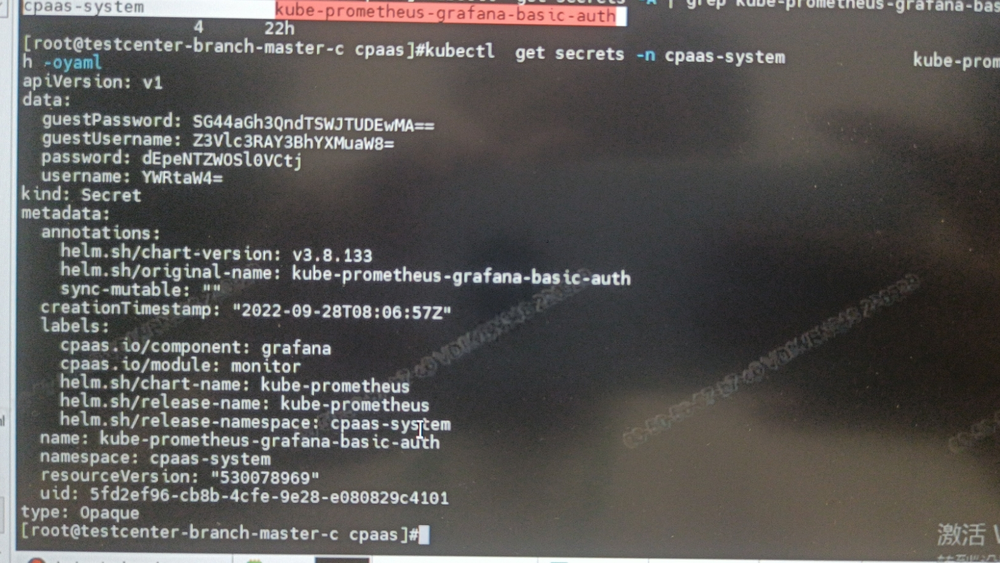

---
kind:
  - Troubleshooting
products:
  - Alauda Container Platform
  - Alauda DevOps
  - Alauda AI
  - Alauda Application Services
  - Alauda Service Mesh
  - Alauda Developer Portal
ProductsVersion:
  - 4.1.0,4.2.x
---
<!-- A type of document that involves encountering a fault, diagnosing it, performing root cause analysis, and providing solutions. -->

# 3.8.2

监控面板502错误 warlock组件日志显示用户密码错误

## Cause
- kube-prometheus-grafana-busic-auth secret中的密码不正确

## Resolution
- 修改kube-prometheus-grafana-busic-auth secret的password字段为admin
- 重启warlock pod

## [workaround]

## [Related Information]
**Screenshots**
3.6.3升级到3.8.2之后,集群监控面板502
1、查看warlock组件日志发现用户密码错误信息
2、检查名为kube-prometheus-grafana-busic-auth secret 发现密码不对
- Environment: 3.6.3升级到3.8.2版本
- warlock
- kube-prometheus-grafana-busic-auth
- password
- Component: Grafana
- Page ID: 127409185
- Original Title: 3.8.2-基础架构-grafana监控面板异常
