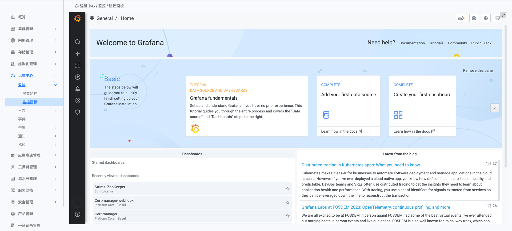

---
kind:
  - Troubleshooting
products:
  - Alauda Container Platform
  - Alauda DevOps
  - Alauda AI
  - Alauda Application Services
  - Alauda Service Mesh
  - Alauda Developer Portal
ProductsVersion:
  - 4.1.0,4.2.x
---
<!-- A type of document that involves encountering a fault, diagnosing it, performing root cause analysis, and providing solutions. -->

# 重新部署监控后grafana面板丢失

监控面板点开后显示无面板

## Cause
- grafanadashboard资源残留
- sentry同步失败

## Resolution
- 删除所有grafanadashboard资源
- 删除所有和grafanadashboard相关的rpch
- 重启sentry容器
- 手动更新monitor的ars(在values下添加任意kv键值触发同步)

## [workaround]

## [Related Information]
**Screenshots**

- Environment: 3.6.x
- grafanadashboard
- rpch
- sentry容器
- monitor的ars
- Component: Grafana
- Page ID: 136521905
- Original Title: 重新部署监控后grafana面板丢失
