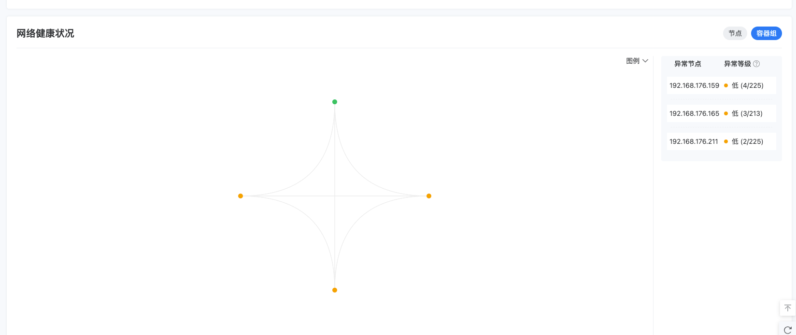
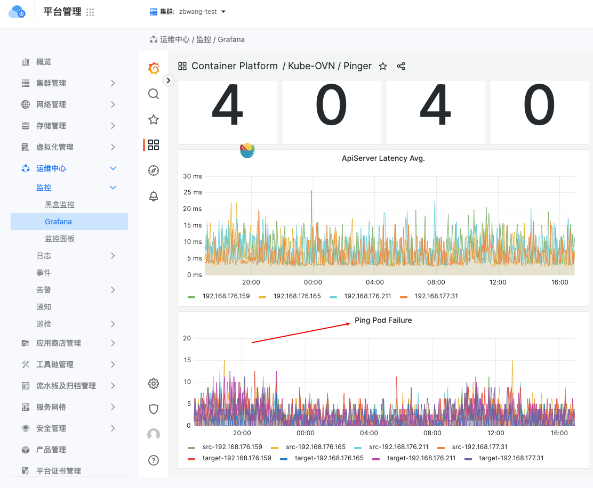
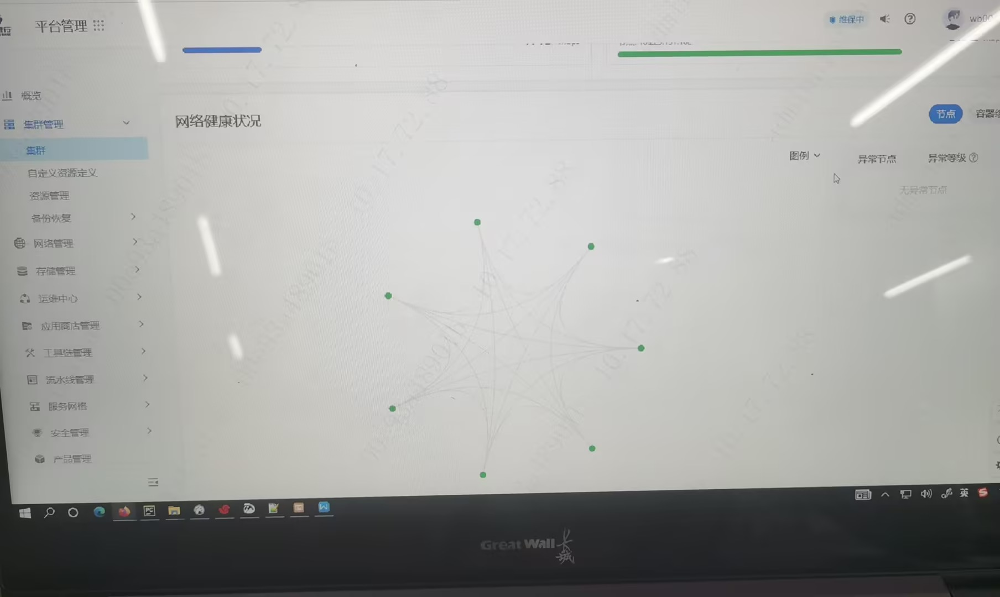
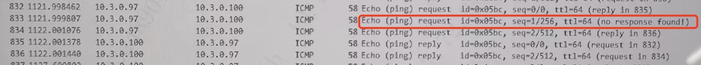
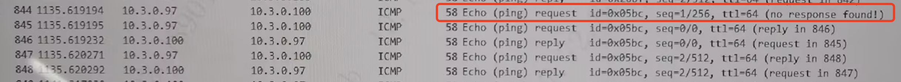
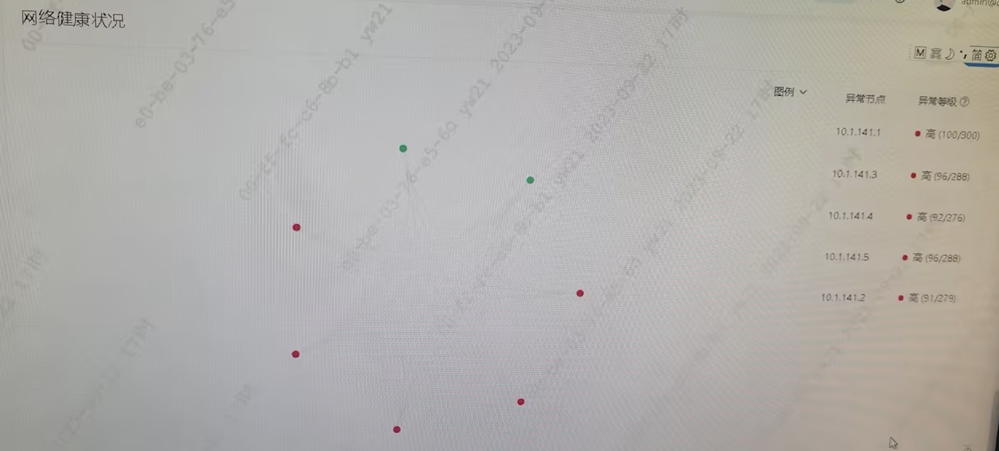
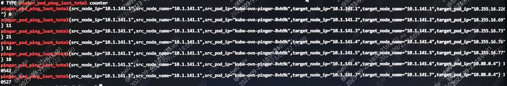

---
kind:
  - Troubleshooting
products:
  - Alauda Container Platform
  - Alauda DevOps
  - Alauda AI
  - Alauda Application Services
  - Alauda Service Mesh
  - Alauda Developer Portal
ProductsVersion:
  - 4.1.0,4.2.x
---
<!-- A type of document that involves encountering a fault, diagnosing it, performing root cause analysis, and providing solutions. -->

# 集群概览页面，网络健康状况中，节点/容器组显示异常

测试集群，集群概览页面，网络健康状况中，容器组显示 低异常等级；生产环境，节点显示高异常等级。 现场版本的 grafana 面板有 bug，无法显示 pinger ping 节点是否有丢包。 查看容器内 netstat -s 未发现异常：

## Cause
- 从抓包结果可以看出，实际并没有丢包，但第二个 ICMP 请求先于第一个请求到达对端 Pod，且时间点非常接近，怀疑是触发丢包的原因。

## Resolution
- ## 排查步骤
- 现场反馈，当天晚上查看状态，又恢复了正常。
- 检查节点上的 CNI 配置：
- 卸载 podman 后重建 pod，并重启节点。
- ## 解决方法

## [workaround]

## [Related Information]
**Screenshots**

- 2023
- 10
- 32
- 127
- 8080
- 46
- //127.0.0.1
- /metrics
- grafana
- Pod
- Component: Grafana
- Page ID: 163078121
- Original Title: 集群概览页面，网络健康状况中，节点/容器组显示异常
