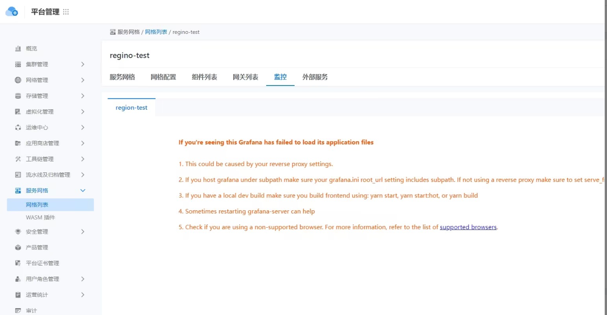
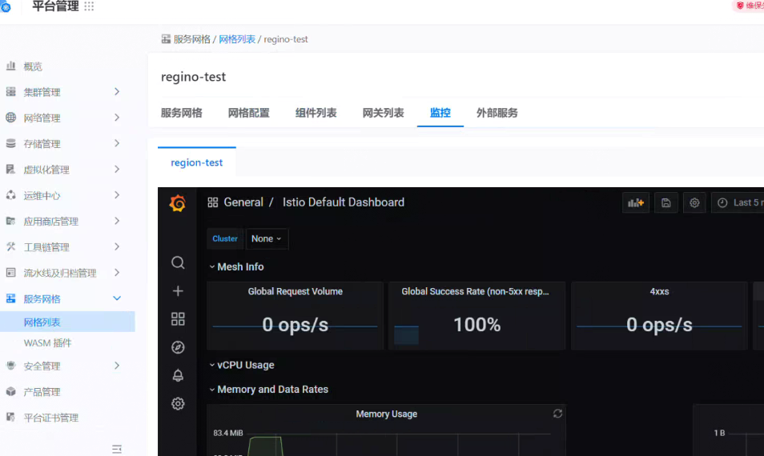

---
kind:
  - Troubleshooting
products:
  - Alauda Container Platform
  - Alauda DevOps
  - Alauda AI
  - Alauda Application Services
  - Alauda Service Mesh
  - Alauda Developer Portal
ProductsVersion:
  - 4.1.0,4.2.x
---
<!-- A type of document that involves encountering a fault, diagnosing it, performing root cause analysis, and providing solutions. -->

# 网格列表中的监控异常

网格列表中的监控异常 grafana服务pod存在重启现象

## Cause
- 服务oom导致重启
- grafana所在节点资源使用率过高

## Resolution
- kubectl edit deployment -n <namespace> 增加grafana服务的requests资源配置，使其与limits保持一致

## [workaround]

## [Related Information]
**Screenshots**

- Environment: ASM服务网格环境中的grafana服务pod所在集群
- grafana
- deployment资源配置
- cpu/memory requests/limits
- Component: Grafana
- Page ID: 168321154
- Original Title: 网格列表中的监控异常
