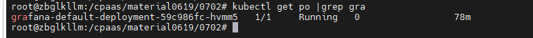
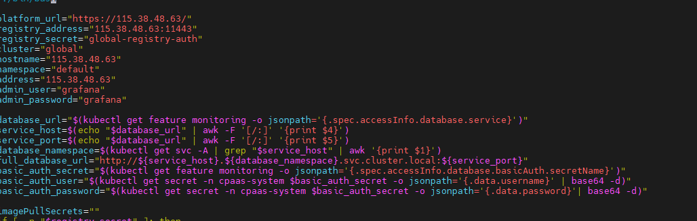
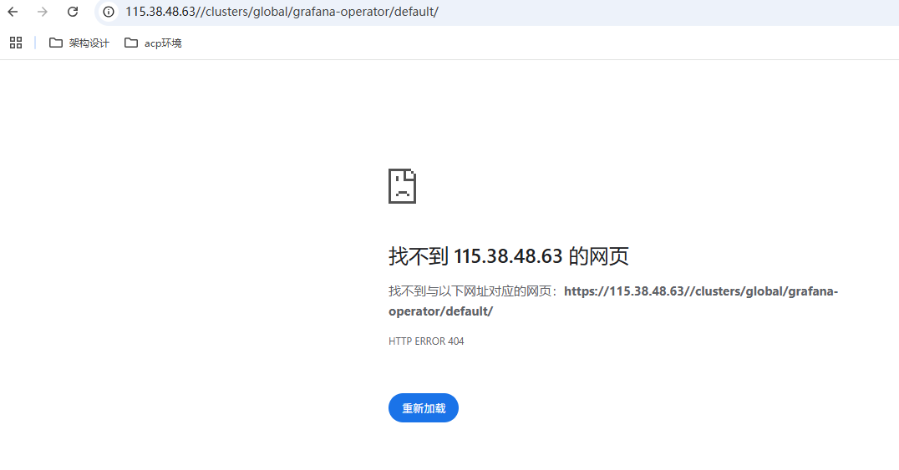

---
kind:
  - Troubleshooting
products:
  - Alauda Container Platform
  - Alauda DevOps
  - Alauda AI
  - Alauda Application Services
  - Alauda Service Mesh
  - Alauda Developer Portal
ProductsVersion:
  - 4.1.0,4.2.x
---
<!-- A type of document that involves encountering a fault, diagnosing it, performing root cause analysis, and providing solutions. -->

# 按照方案部署grafana无法访问

访问Grafana返回404错误 NodePort访问跳转路径后显示找不到网页

## Cause
- grafana-operator与grafana实例使用的社区镜像存在不兼容问题

## Resolution
- 更换为方案中指定的grafana实例镜像

## [workaround]

## [Related Information]
**Screenshots**

- Environment: 单点部署，基础架构版本4.0.1
- grafana-operator
- 负载均衡器
- 内部路由
- NodePort
- grafana实例镜像
- Component: Grafana
- Page ID: 327811953
- Original Title: 基础架构-按照方案部署grafana无法访问-112318
