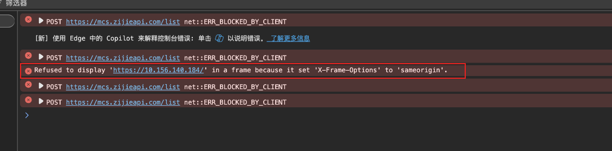
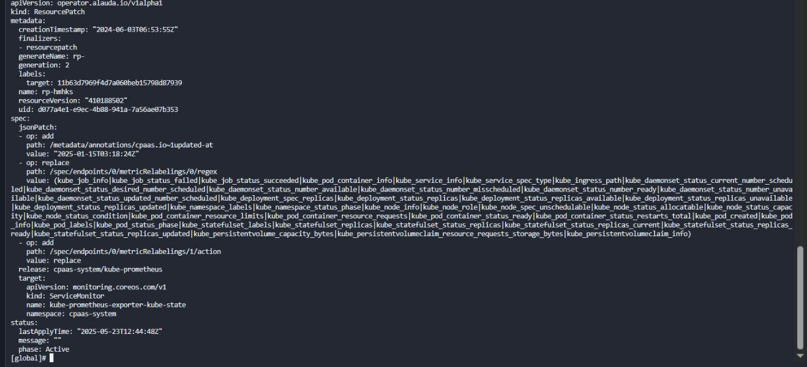

---
kind:
  - Troubleshooting
products:
  - Alauda Container Platform
  - Alauda DevOps
  - Alauda AI
  - Alauda Application Services
  - Alauda Service Mesh
  - Alauda Developer Portal
ProductsVersion:
  - 4.1.0,4.2.x
---
<!-- A type of document that involves encountering a fault, diagnosing it, performing root cause analysis, and providing solutions. -->

# 运维中心里的 grafana 中的 dashborad 要 share 到外部系统使用 iframe

运维中心Grafana dashboard通过iframe嵌入外部系统时报错 所有集群的Deployment下监控不显示，但Pod/STS/DS监控正常

## Cause
- ALB同源策略配置问题
- kube-state-exporter配置变更（新增kube_job_info等采集项）

## Resolution
- 使用外部nginx反向代理并移除同源策略相关头部

## [workaround]
- 将Grafana接入新ALB暴露
- 尝试自建Ingress进行访问

## [Related Information]
**Screenshots**

- Environment: 3.14
- ALB
- Ingress
- nginx
- kube-state-exporter
- kube_job_info
- Component: Grafana
- Page ID: 330466292
- Original Title: 容器平台-网络-运维中心里的 grafana 中的 dashborad 要 share 到外部系统使用 iframe-114115
