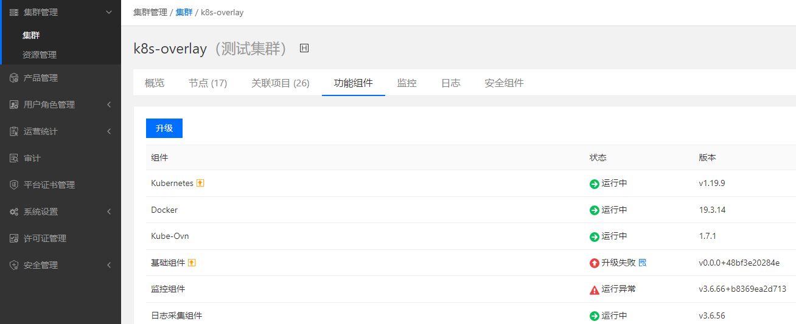
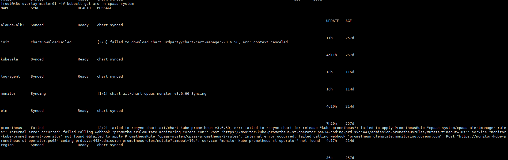
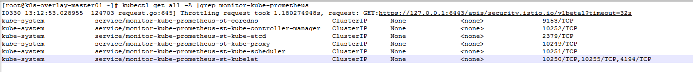

---
kind:
  - Troubleshooting
products:
  - Alauda Container Platform
  - Alauda DevOps
  - Alauda AI
  - Alauda Application Services
  - Alauda Service Mesh
  - Alauda Developer Portal
ProductsVersion:
  - 4.1.0,4.2.x
---
<!-- A type of document that involves encountering a fault, diagnosing it, performing root cause analysis, and providing solutions. -->

# 3.6.1

基础组件和监控组件自动升级失败并显示运行异常 业务集群ars资源同步异常 Prometheus报错找不到monitor-kube-prometheus-st-operator资源

## Cause
- 通过应用目录部署的kube-prometheus-stack模板应用导致sentry同步ars资源异常

## Resolution
- 删除对应的hr资源及模板应用
- 重启sentry组件pod触发ars资源同步

## [workaround]

## [Related Information]
**Screenshots**

2、发现默认部署业务集群不存在的svc
- Environment: 3.6.1
- ars资源同步
- sentry组件
- kube-prometheus-stack
- hr资源
- cpaas-system命名空间
- Component: Prometheus
- Page ID: 112044563
- Original Title: 3.6.1-容器平台-业务集群功能组件显示异常
