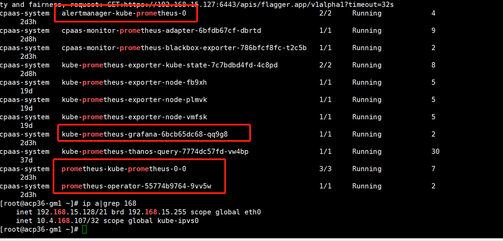

---
kind:
  - Troubleshooting
products:
  - Alauda Container Platform
  - Alauda DevOps
  - Alauda AI
  - Alauda Application Services
  - Alauda Service Mesh
  - Alauda Developer Portal
ProductsVersion:
  - 4.1.0,4.2.x
---
<!-- A type of document that involves encountering a fault, diagnosing it, performing root cause analysis, and providing solutions. -->

# prometheus更换数据盘

/cpaas盘满 监控异常

## Cause
- Prometheus数据盘空间不足

## Resolution
- 停止sentry
- 调整prometheus pod副本数为0
- 挂载新盘到临时目录并复制数据：mount新盘→cp /cpaas/monitoring/prometheus → umount→重新挂载到/cpaas/monitoring/prometheus
- 恢复pod副本数并重启sentry

## [workaround]

## [Related Information]
**Screenshots**
2 图片标记pod副本数调为0
- Environment: 3.4.2
- /cpaas/monitoring/prometheus
- sentry
- prometheus pod
- 数据盘挂载
- Component: Prometheus
- Page ID: 115513409
- Original Title: prometheus更换数据盘
