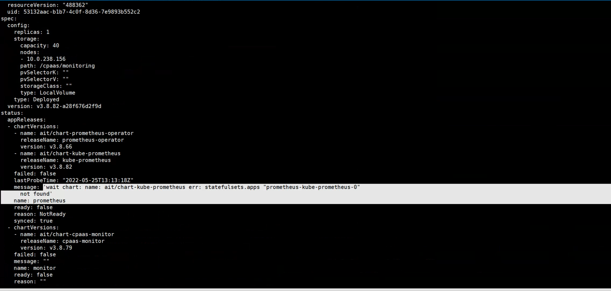
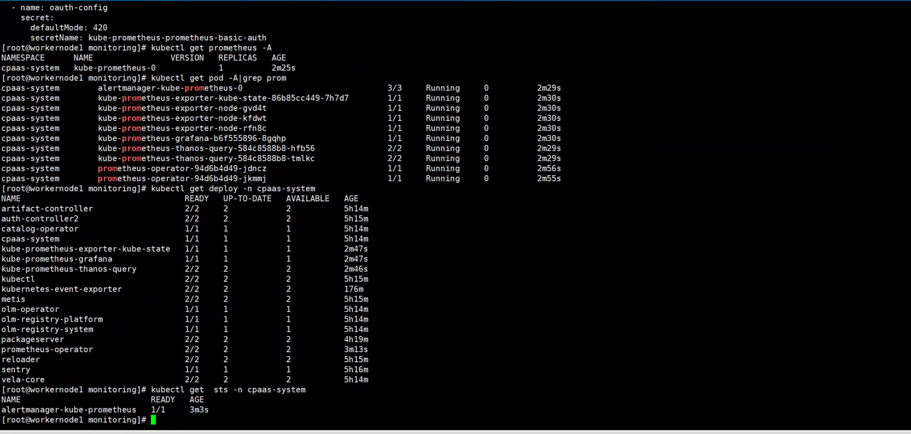
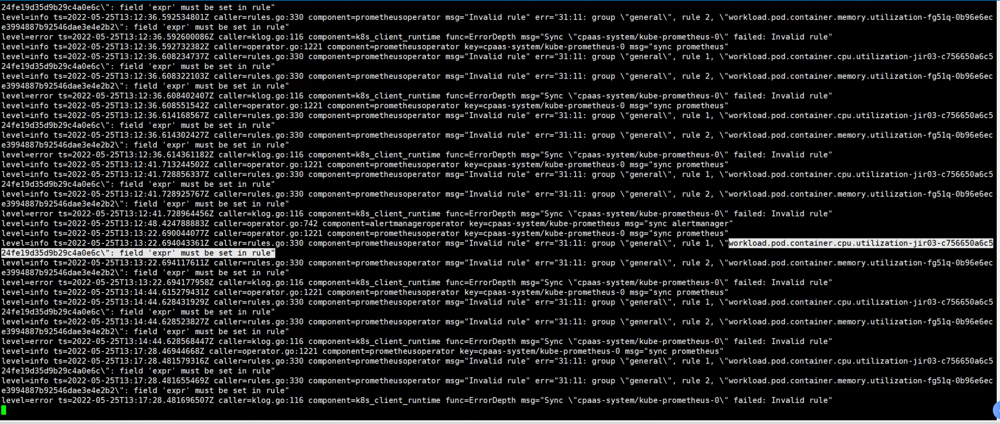
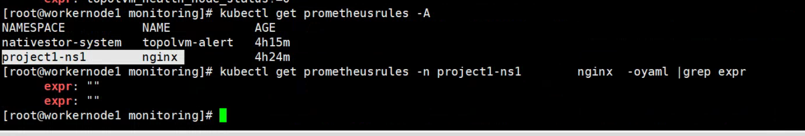

---
kind:
  - Troubleshooting
products:
  - Alauda Container Platform
  - Alauda DevOps
  - Alauda AI
  - Alauda Application Services
  - Alauda Service Mesh
  - Alauda Developer Portal
ProductsVersion:
  - 4.1.0,4.2.x
---
<!-- A type of document that involves encountering a fault, diagnosing it, performing root cause analysis, and providing solutions. -->

# 业务集群监控组件部署异常

页面不显示监控数据且一直提示部署中 global集群检查发现prometheus-0的sts未找到 业务集群缺少prometheus-0容器和sts

## Cause
- 存在表达式为空的prometheusrules触发平台bug，导致sts无法创建

## Resolution
- 清理所有表达式为空的prometheusrules

## [workaround]

## [Related Information]
**Screenshots**

- Environment: v3.8.1 监控组件/Prometheus
- prometheus-0
- prometheus-operator
- prometheusrules
- StatefulSet(sts)
- Component: Prometheus
- Page ID: 115528382
- Original Title: 业务集群监控组件部署异常
