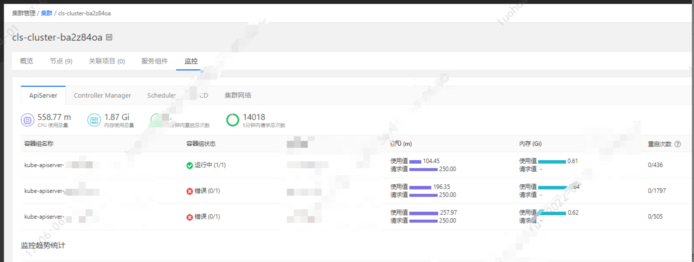

---
kind:
  - Troubleshooting
products:
  - Alauda Container Platform
  - Alauda DevOps
  - Alauda AI
  - Alauda Application Services
  - Alauda Service Mesh
  - Alauda Developer Portal
ProductsVersion:
  - 4.1.0,4.2.x
---
<!-- A type of document that involves encountering a fault, diagnosing it, performing root cause analysis, and providing solutions. -->

# 平台管理集群监控下的核心组件状态显示异常

核心组件状态显示异常但实际运行正常 kube-state容器重启次数1436次（OOM kill） kube-pod-containers-ready接口显示异常为0

## Cause
- kube-state资源配置过小导致OOM kill
- 容器假死无法获取最新监控数据

## Resolution
- kubectl -n cpaas-system edit deploy kube-prometheus-exporter-kube-state
- 调大参数：--extra-memory=200Mi 和 --extra-cpu=50m
- kubectl -n cpaas-system annotate deploy kube-prometheus-exporter-kube-state skip-sync=true

## [workaround]

## [Related Information]
**Screenshots**

- Environment: 3.4.1
- kube-state-metrics
- kube-pod-containers-ready接口
- Prometheus
- --extra-memory
- --extra-cpu
- cpaas-system命名空间
- Component: Prometheus
- Page ID: 115528423
- Original Title: 平台管理集群监控下的核心组件状态显示异常
