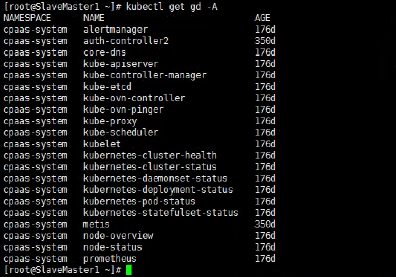
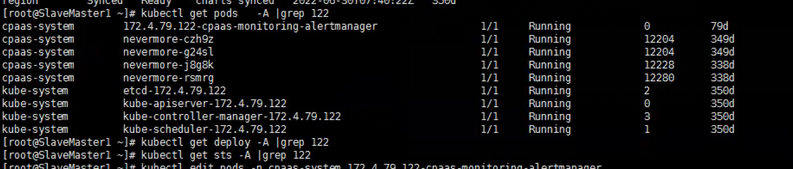
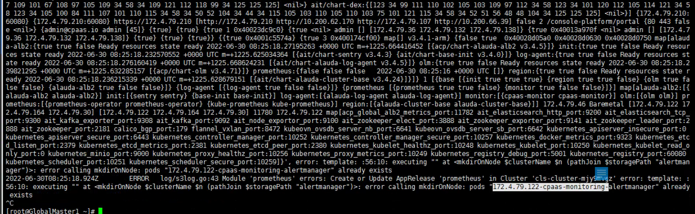

---
kind:
  - Troubleshooting
products:
  - Alauda Container Platform
  - Alauda DevOps
  - Alauda AI
  - Alauda Application Services
  - Alauda Service Mesh
  - Alauda Developer Portal
ProductsVersion:
  - 4.1.0,4.2.x
---
<!-- A type of document that involves encountering a fault, diagnosing it, performing root cause analysis, and providing solutions. -->

# 3.4.1

业务集群部署prometheus后台没有容器启动 部署新监控时卡住

## Cause
- 节点122存在未清理的gd监控残留资源
- 资源finalizer字段阻断删除操作

## Resolution
- 手动清理现有监控残留资源
- 移除资源finalizer字段后强制删除
- 删除残留pod资源后重新部署监控

## [workaround]

## [Related Information]
**Screenshots**

- Environment: 3.4.1
- gd资源
- finalizer字段
- pod资源
- prometheus监控组件
- Component: Prometheus
- Page ID: 119086403
- Original Title: 3.4.1--可视化运维-业务集群部署prometheus后台没有容器启动
