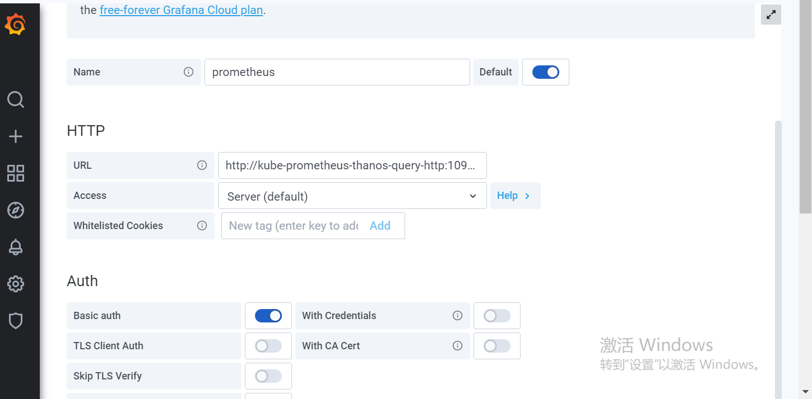
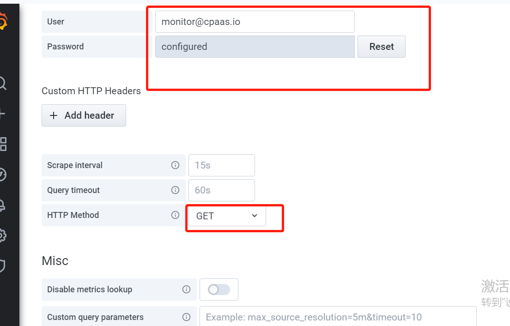

---
kind:
  - Troubleshooting
products:
  - Alauda Container Platform
  - Alauda DevOps
  - Alauda AI
  - Alauda Application Services
  - Alauda Service Mesh
  - Alauda Developer Portal
ProductsVersion:
  - 4.1.0,4.2.x
---
<!-- A type of document that involves encountering a fault, diagnosing it, performing root cause analysis, and providing solutions. -->

# 监控异常

监控面板显示502 数据服务监控报错：datasource prometheus not found grafana pod报错：无效的用户名密码

## Cause
- 升级前grafana密码被修改导致认证失败
- 缺少Prometheus数据源配置

## Resolution
- kubectl edit secret -ncpaas-system kube-prometheus-grafana-basic-auth 修改password字段(base64加密)
- 访问监控面板添加Prometheus数据源：URL=http://kube-prometheus-thanos-query-http:10902，凭证来自cpaas-system/kube-prometheus-prometheus-basic-auth

## [workaround]

## [Related Information]
**Screenshots**

- Environment: 3.8
- kube-prometheus-grafana-basic-auth
- kube-prometheus-prometheus-basic-auth
- kube-prometheus-thanos-query-http:10902
- Grafana
- Prometheus
- Component: Prometheus
- Page ID: 124697736
- Original Title: 监控异常
