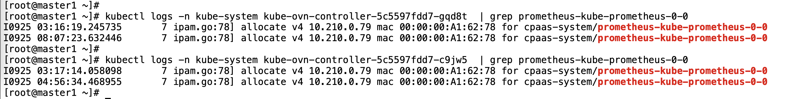
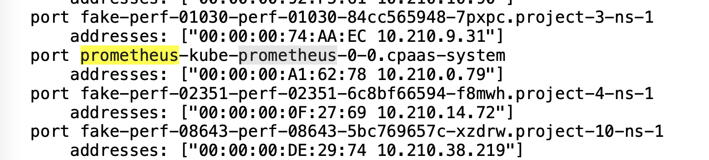
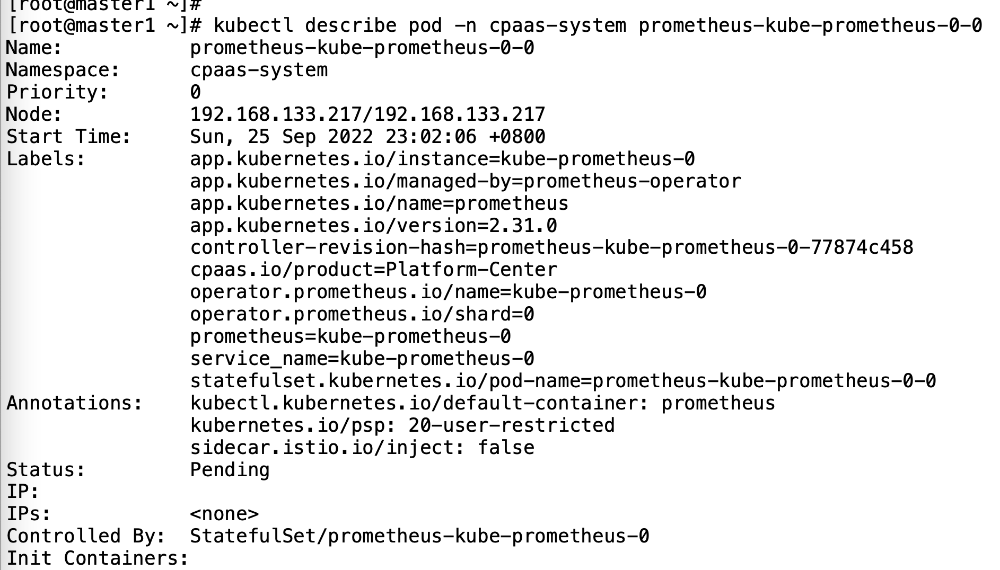
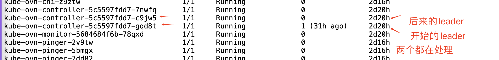
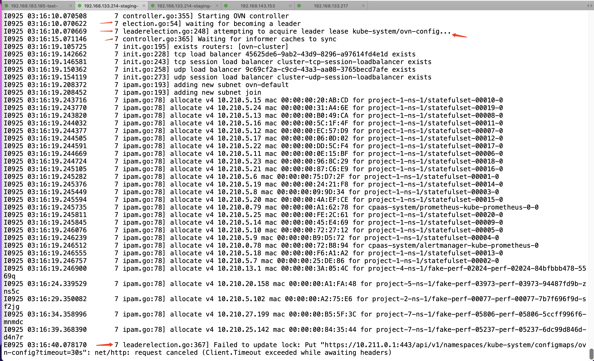
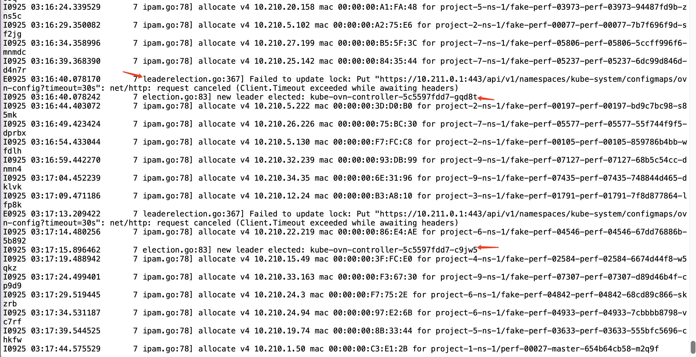
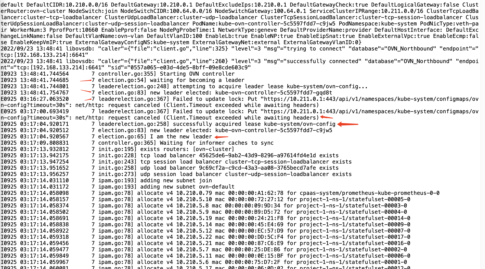
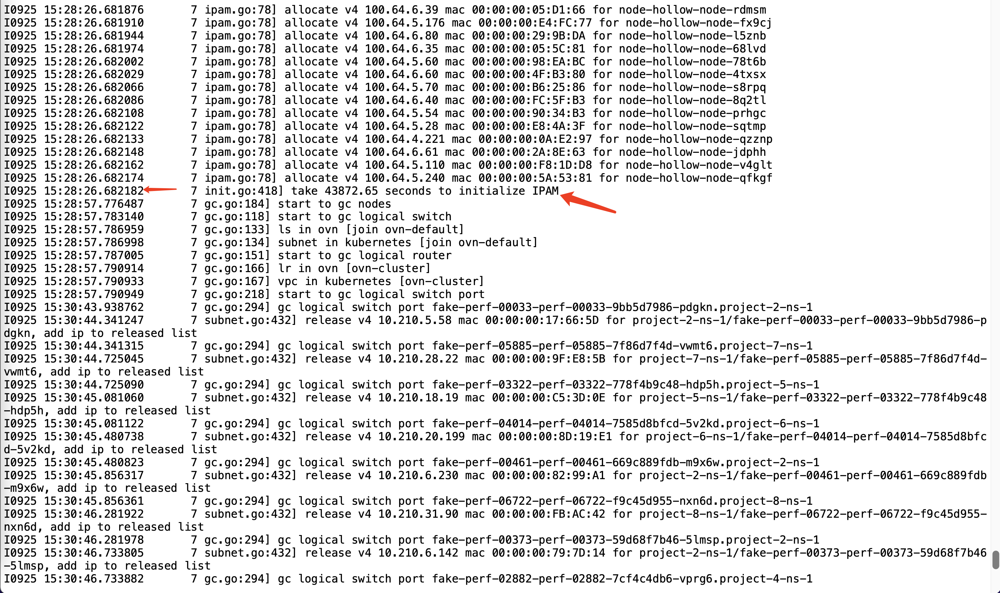
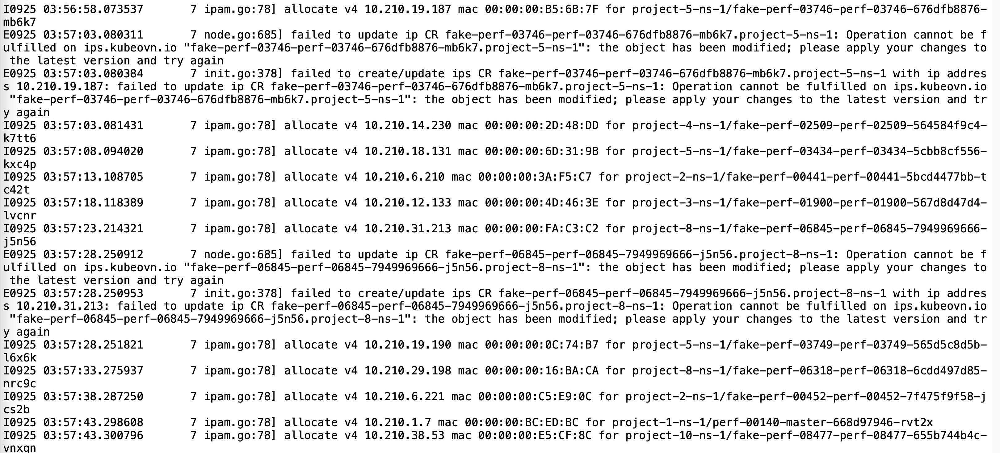

---
kind:
  - Troubleshooting
products:
  - Alauda Container Platform
  - Alauda DevOps
  - Alauda AI
  - Alauda Application Services
  - Alauda Service Mesh
  - Alauda Developer Portal
ProductsVersion:
  - 4.1.0,4.2.x
---
<!-- A type of document that involves encountering a fault, diagnosing it, performing root cause analysis, and providing solutions. -->

# 2022

Prometheus pod启动不了，一直在init状态 两个kube-ovn-controller中出现多个leader的log信息 pod没有IP信息

## Cause
- 两个kube-ovn-controller同时修改资源导致冲突
- ipam初始化时间过长(约12小时)

## Resolution

## [workaround]

## [Related Information]
**Screenshots**

- kube-ovn-controller
- ipam初始化
- leader选举机制
- Component: Prometheus
- Page ID: 127403965
- Original Title: 2022-09-26 ACP staging环境，kube-ovn-controller出现多个leader问题
