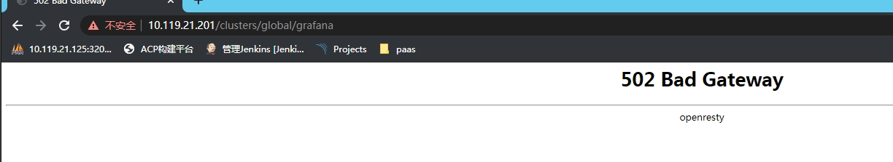
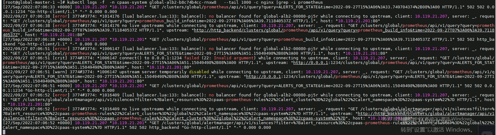
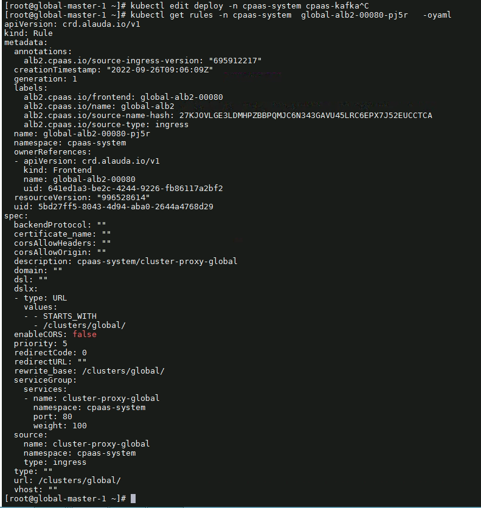
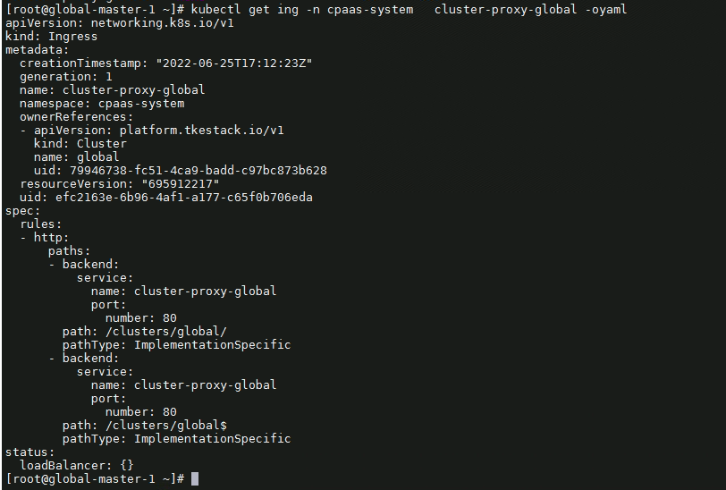
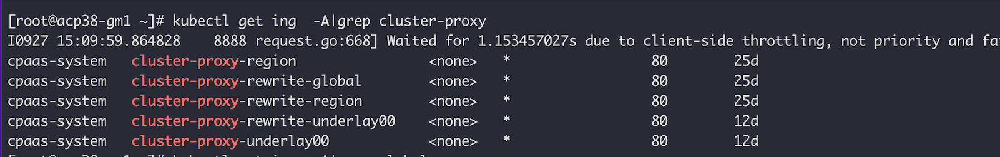

---
kind:
  - Troubleshooting
products:
  - Alauda Container Platform
  - Alauda DevOps
  - Alauda AI
  - Alauda Application Services
  - Alauda Service Mesh
  - Alauda Developer Portal
ProductsVersion:
  - 4.1.0,4.2.x
---
<!-- A type of document that involves encountering a fault, diagnosing it, performing root cause analysis, and providing solutions. -->

# global监控无法展示，报错502

global监控无法展示，报错502 alb2访问记录显示no balancer found for global-xxx

## Cause
- 3.6升级3.8后残留cluster-proxy-global ingress规则
- ingress规则中svc端口与实际svc端口不一致

## Resolution
- 删除残留的cluster-proxy-global规则

## [workaround]

## [Related Information]
**Screenshots**

- Environment: 3.6升级3.8
- cluster-proxy-global
- prometheus svc
- alb2
- Component: Prometheus
- Page ID: 127404663
- Original Title: global监控无法展示，报错502
