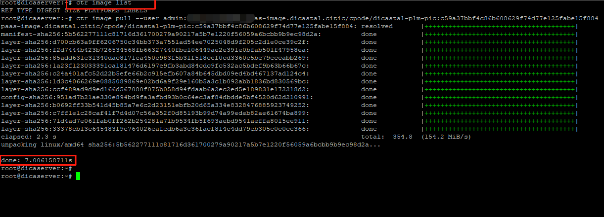

---
kind:
  - Troubleshooting
products:
  - Alauda Container Platform
  - Alauda DevOps
  - Alauda AI
  - Alauda Application Services
  - Alauda Service Mesh
  - Alauda Developer Portal
ProductsVersion:
  - 4.1.0,4.2.x
---
<!-- A type of document that involves encountering a fault, diagnosing it, performing root cause analysis, and providing solutions. -->

# 集群不显示监控数据

Grafana上Kubernetes Node Status不显示node数据 Thanos存在无法resolve prometheus名称的报错 prometheus adapter日志显示node的CPU metrics被skipped

## Cause
- 修改servicemonitor导致node-exporter抓取失败

## Resolution
- 检查并修复servicemonitor配置

## [workaround]

## [Related Information]
**Screenshots**

- Environment: TKE 3.6以上
- servicemonitor
- node-exporter
- prometheus
- thanos
- coredns
- grafana
- Component: Prometheus
- Page ID: 127420090
- Original Title: 集群不显示监控数据
