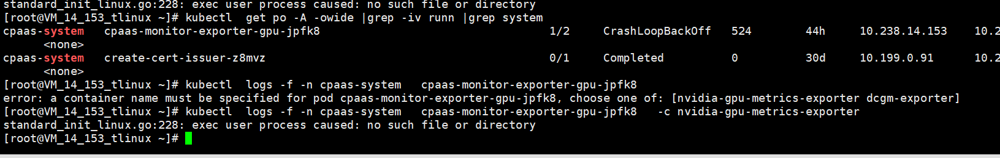

---
kind:
  - Troubleshooting
products:
  - Alauda Container Platform
  - Alauda DevOps
  - Alauda AI
  - Alauda Application Services
  - Alauda Service Mesh
  - Alauda Developer Portal
ProductsVersion:
  - 4.1.0,4.2.x
---
<!-- A type of document that involves encountering a fault, diagnosing it, performing root cause analysis, and providing solutions. -->

# 3.4.5 exporter

容器状态为crashbackoff 日志报错no such file or directory 应用监控无法查看

## Cause
- 修改漏洞时替换了base镜像导致二进制缺少glibc依赖

## Resolution
- 更新该组件镜像版本
- 升级平台版本

## [workaround]

## [Related Information]
**Screenshots**

- Environment: 3.4.5
- cpaas-monitor-exporter-gpu
- glibc
- prometheus
- Component: Prometheus
- Page ID: 127427957
- Original Title: 3.4.5 exporter-gpu容器无法启动报错no such file or directory
