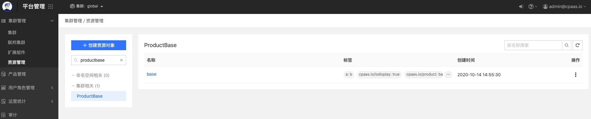
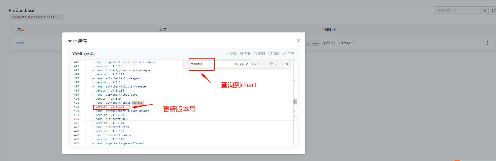
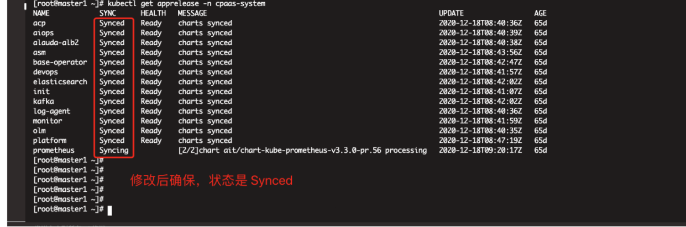
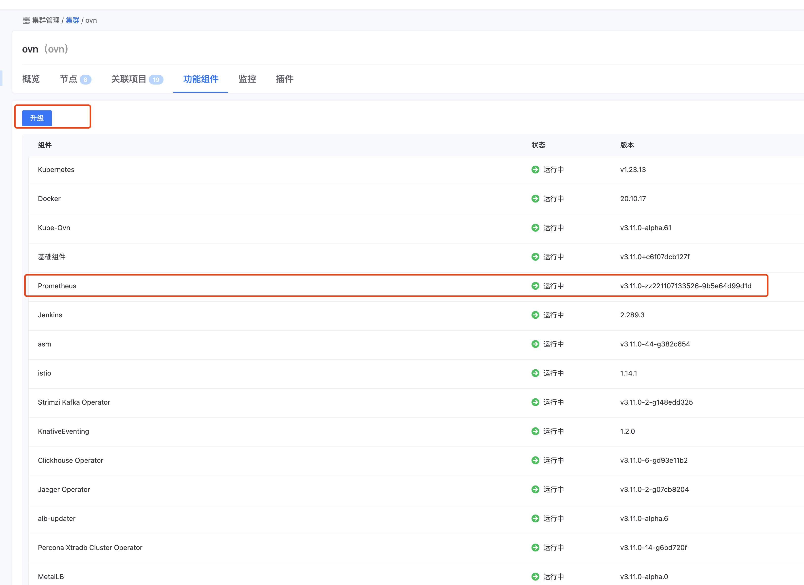

---
kind:
  - Troubleshooting
products:
  - Alauda Container Platform
  - Alauda DevOps
  - Alauda AI
  - Alauda Application Services
  - Alauda Service Mesh
  - Alauda Developer Portal
ProductsVersion:
  - 4.1.0,4.2.x
---
<!-- A type of document that involves encountering a fault, diagnosing it, performing root cause analysis, and providing solutions. -->

# 3.8

内存告警信息错误 container_memory_working_set_bytes 与 container_memory_usage_bytes 查询的内存使用率不一致

## Cause
- 监控组件使用的内存告警规则与 kubectl top pod 使用的内存指标不一致

## Resolution
- 上传 chart 压缩包到 global 集群 master1 节点并解压到 /tmp/cpaas-monitor
- 执行 helm3 chart save 和 helm3 chart push 命令上传到本地 60080 仓库
- 在平台管理界面更新 ProductBase 资源中的 chart 版本号
- 检查 cpaas-system 下的所有 apprelease 资源确保 Synced 状态
- 在业务集群中升级 prometheus 组件至新版本

## [workaround]

## [Related Information]
**Screenshots**

- Environment: 3.8
- container_memory_working_set_bytes
- container_memory_usage_bytes
- ProductBase 资源
- cpaas-monitor
- helm3
- 本地:60080 仓库
- /etc/kubernetes/registry/auth.yaml
- Component: Prometheus
- Page ID: 130551151
- Original Title: 3.8-变更平台monitor组件chart版本操作文档
