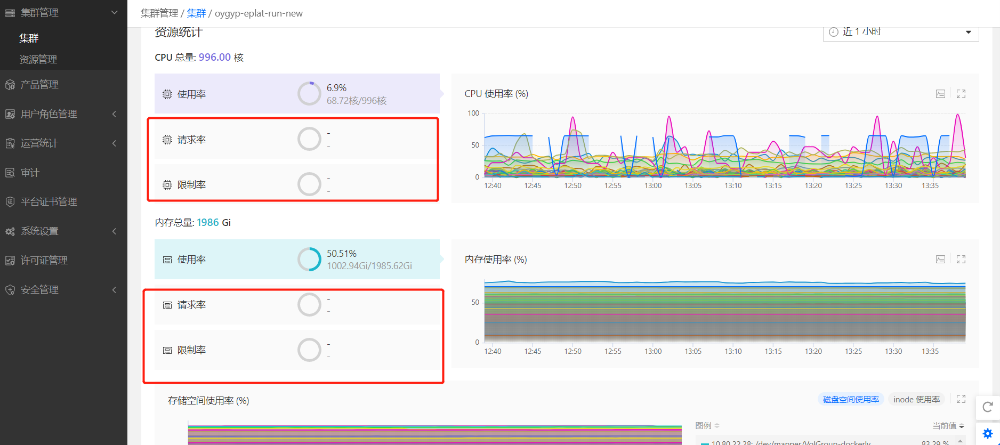
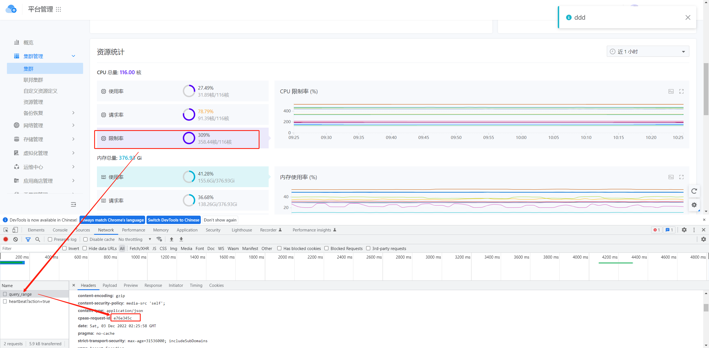
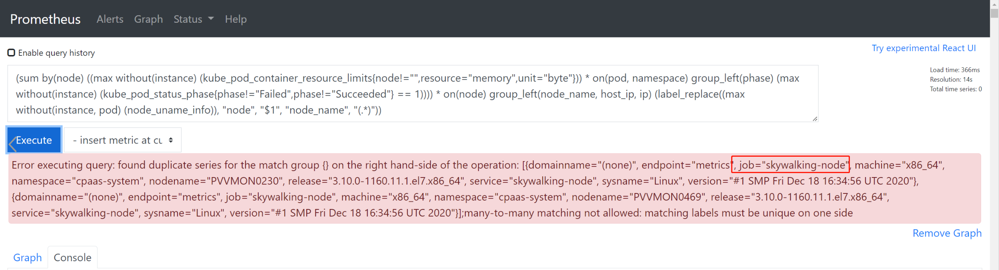
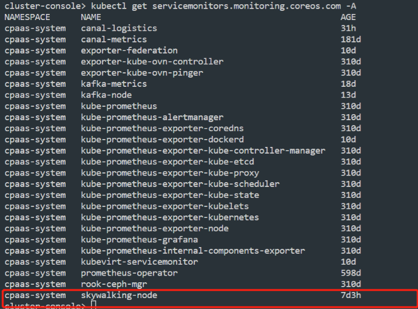

---
kind:
  - Troubleshooting
products:
  - Alauda Container Platform
  - Alauda DevOps
  - Alauda AI
  - Alauda Application Services
  - Alauda Service Mesh
  - Alauda Developer Portal
ProductsVersion:
  - 4.1.0,4.2.x
---
<!-- A type of document that involves encountering a fault, diagnosing it, performing root cause analysis, and providing solutions. -->

# 3.8.2

集群概率页面监控显示异常 Prometheus查询数据为空 PromQL表达式报错

## Cause
- 客户自建的servicemonitors资源与平台规则冲突

## Resolution
- 清理客户自建的servicemonitors资源

## [workaround]

## [Related Information]
**Screenshots**

- Environment: 3.8.2
- servicemonitors
- kube_pod_container_resource_limits
- kube_pod_status_phase
- node_uname_info
- PromQL表达式
- Component: Prometheus
- Page ID: 130577393
- Original Title: 3.8.2-集群概率页面监控显示异常
