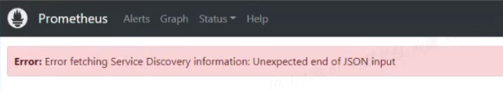

---
kind:
  - Troubleshooting
products:
  - Alauda Container Platform
  - Alauda DevOps
  - Alauda AI
  - Alauda Application Services
  - Alauda Service Mesh
  - Alauda Developer Portal
ProductsVersion:
  - 4.1.0,4.2.x
---
<!-- A type of document that involves encountering a fault, diagnosing it, performing root cause analysis, and providing solutions. -->

# prometheus Service Discovery 页面无法访问

Service Discovery 页面加载异常 Error: Error fetching Service Discovery information: Unexpected end of JSON input

## Cause
- servicemonitor 资源数量过多(79个)导致响应数据过大
- 集群规模大(80节点)导致请求超时

## Resolution
- 适当删减部分 servicemonitor 资源

## [workaround]

## [Related Information]
**Screenshots**

- Environment: 通用版本
- servicemonitor
- Component: Prometheus
- Page ID: 133076253
- Original Title: prometheus Service Discovery 页面无法访问
