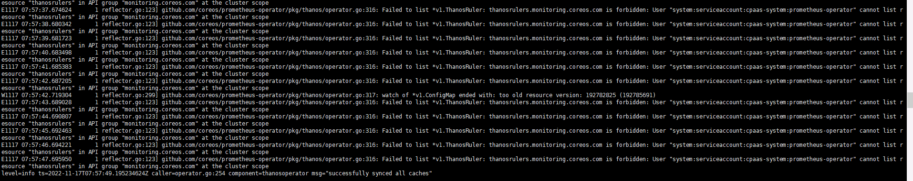

---
kind:
  - Troubleshooting
products:
  - Alauda Container Platform
  - Alauda DevOps
  - Alauda AI
  - Alauda Application Services
  - Alauda Service Mesh
  - Alauda Developer Portal
ProductsVersion:
  - 4.1.0,4.2.x
---
<!-- A type of document that involves encountering a fault, diagnosing it, performing root cause analysis, and providing solutions. -->

# 2.9

prometheus apprelease not ready UI页面无法打开业务集群的grafana页面 describe apprelease提示Message: timed out waiting for the condition

## Cause
- prometheus-operator缺少list thanosrules权限

## Resolution
- 将cluster-admin权限赋权给prometheus-operator sa
- 重新触发prometheus ars同步

## [workaround]

## [Related Information]
**Screenshots**

- Environment: TKE 2.9
- thanosrules
- prometheus-operator
- cluster-admin
- apprelease
- grafana
- Component: Prometheus
- Page ID: 133095024
- Original Title: 2.9-prometheus ars显示not ready
