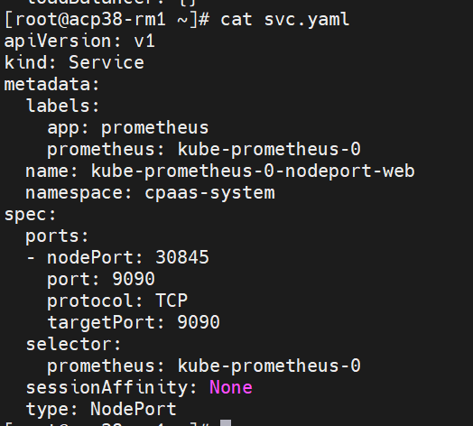
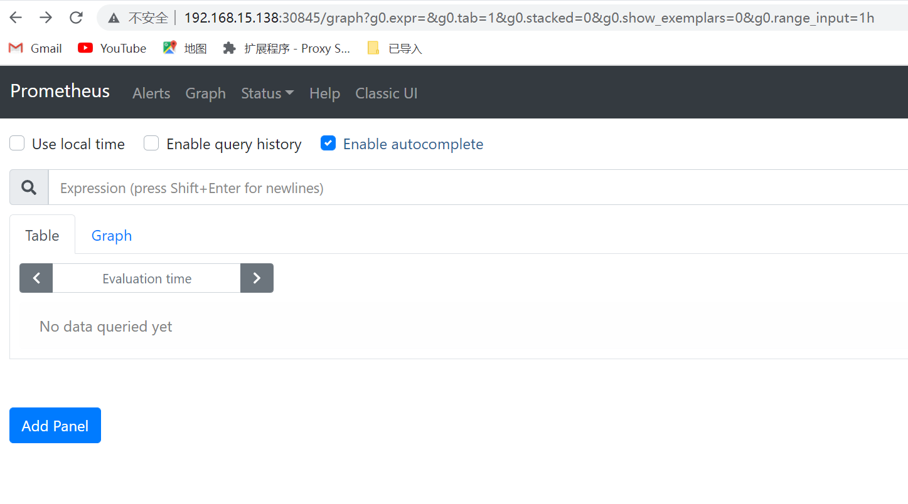

---
kind:
  - Troubleshooting
products:
  - Alauda Container Platform
  - Alauda DevOps
  - Alauda AI
  - Alauda Application Services
  - Alauda Service Mesh
  - Alauda Developer Portal
ProductsVersion:
  - 4.1.0,4.2.x
---
<!-- A type of document that involves encountering a fault, diagnosing it, performing root cause analysis, and providing solutions. -->

# global on cce 访问prometheus界面

无法跳转到prometheus界面

## Cause
- auth-proxy容器端口强制使用tke本地账户认证
- global on cce版本无本地账户体系

## Resolution
- 创建绕过auth-proxy的service(svc.yaml)
- 通过prometheus-0所在节点的nodeip:nodeport/graph访问

## [workaround]

## [Related Information]
**Screenshots**

- Environment: global on cce
- auth-proxy
- prometheus-0
- nodeport
- svc.yaml
- /graph
- Component: Prometheus
- Page ID: 136514367
- Original Title: global on cce 访问prometheus界面
