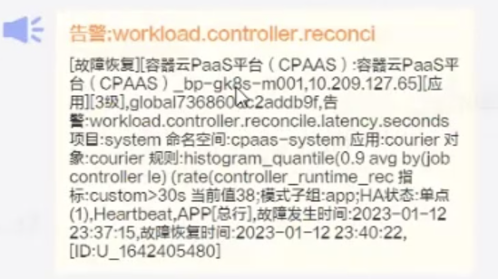
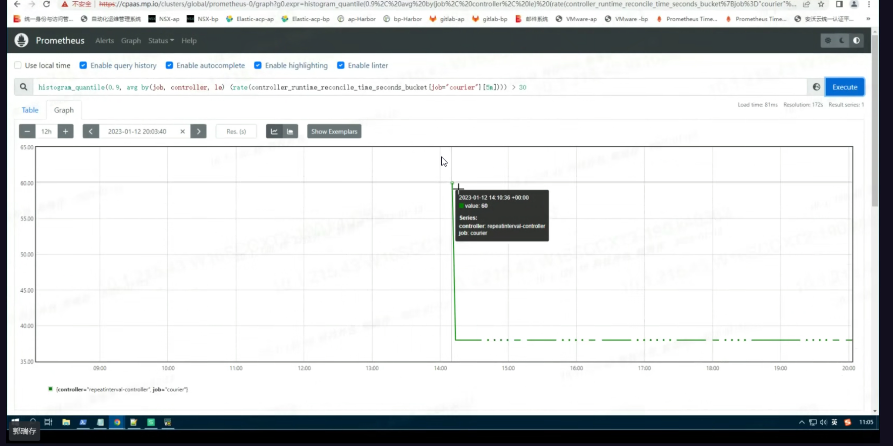

---
kind:
  - Troubleshooting
products:
  - Alauda Container Platform
  - Alauda DevOps
  - Alauda AI
  - Alauda Application Services
  - Alauda Service Mesh
  - Alauda Developer Portal
ProductsVersion:
  - 4.1.0,4.2.x
---
<!-- A type of document that involves encountering a fault, diagnosing it, performing root cause analysis, and providing solutions. -->

# courier组件处理资源延迟告警

触发告警项workload.controller.reconcile.latency.seconds 触发告警的controller为repetinterval-controller

## Cause
- 同步告警间隔到各集群alertmanager时，单次reconcile时间受集群个数和网络质量影响
- 告警项触发时间被修改后触发同步

## Resolution
- 静默该告警规则
- 调整告警阈值降低敏感度

## [workaround]

## [Related Information]
**Screenshots**

- Environment: 3.8.1
- courier
- alertmanager
- repetinterval-controller
- container_runtime_reconcile_time_seconds_bucket
- workload.controller.reconcile.latency.seconds
- Component: Prometheus
- Page ID: 136517160
- Original Title: courier组件处理资源延迟告警
