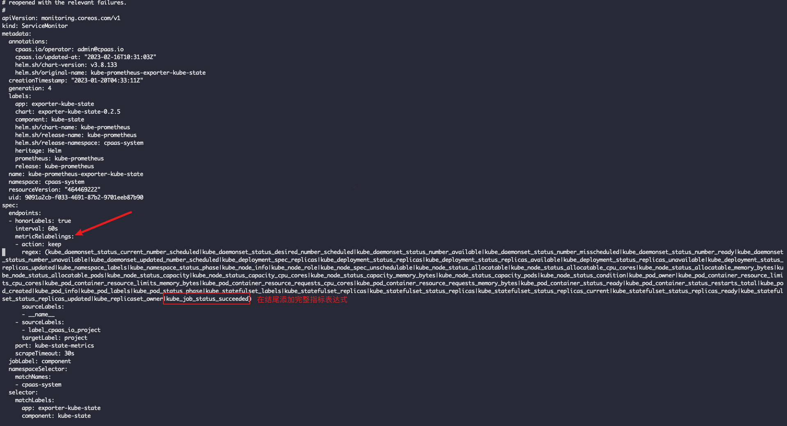
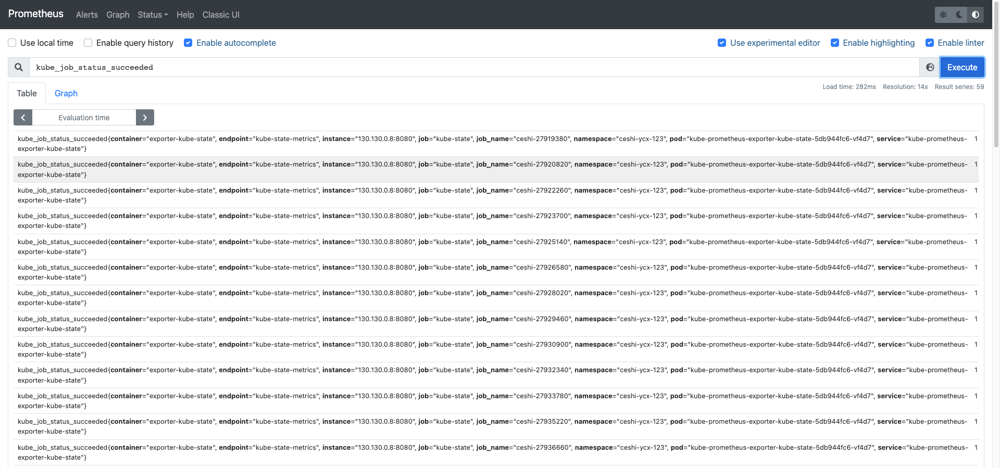

---
kind:
  - Troubleshooting
products:
  - Alauda Container Platform
  - Alauda DevOps
  - Alauda AI
  - Alauda Application Services
  - Alauda Service Mesh
  - Alauda Developer Portal
ProductsVersion:
  - 4.1.0,4.2.x
---
<!-- A type of document that involves encountering a fault, diagnosing it, performing root cause analysis, and providing solutions. -->

# 平台监控指标缺失部分原生指标

无法通过平台prometheus查询原生组件的监控指标 升级到3.8/3.10版本后出现指标缺失

## Cause
- 平台从3.8版本开始优化监控指标采集范围
- 原生监控指标被主动排除以提升性能

## Resolution
- 修改对应组件的servicemonitor配置
- 在metricRelabelings.keep下添加需要保留的指标表达式

## [workaround]

## [Related Information]
**Screenshots**

- Environment: 3.8,3.10
- kube-prometheus-exporter-kube-state
- servicemonitor
- kube_job_status_succeeded
- metricRelabelings
- Component: Prometheus
- Page ID: 136540029
- Original Title: 平台监控指标缺失部分原生指标
