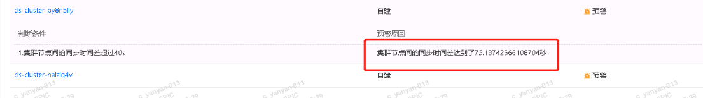

---
kind:
  - Troubleshooting
products:
  - Alauda Container Platform
  - Alauda DevOps
  - Alauda AI
  - Alauda Application Services
  - Alauda Service Mesh
  - Alauda Developer Portal
ProductsVersion:
  - 4.1.0,4.2.x
---
<!-- A type of document that involves encountering a fault, diagnosing it, performing root cause analysis, and providing solutions. -->

# 巡检提示节点时间不同步

巡检提示节点时间不同步

## Cause
- 3.4.2版本prometheus抓取数据存在延迟

## Resolution
- 升级到3.8版本修复该问题
- 3.4版本可忽略该告警

## [workaround]

## [Related Information]
**Screenshots**

- Environment: 3.4.2
- prometheus
- Component: Prometheus
- Page ID: 140807392
- Original Title: 巡检提示节点时间不同步
