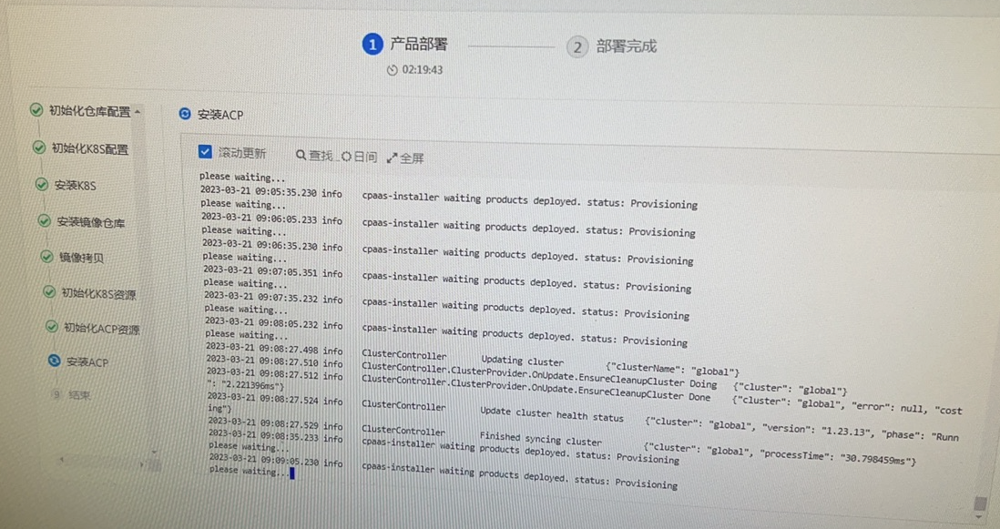

---
kind:
  - Troubleshooting
products:
  - Alauda Container Platform
  - Alauda DevOps
  - Alauda AI
  - Alauda Application Services
  - Alauda Service Mesh
  - Alauda Developer Portal
ProductsVersion:
  - 4.1.0,4.2.x
---
<!-- A type of document that involves encountering a fault, diagnosing it, performing root cause analysis, and providing solutions. -->

# 部署3.10平台卡在部署监控中，prometheus报错“400 give http request to https server"

部署界面卡在安装ACP，prometheus容器crash prometheus-0访问平台地址报错"400 give http request to https server" 手动curl -kv https://<域名>报错400

## Cause
- F5转发配置为HTTPS并配置了合法域名证书，平台部署使用自签证书导致证书不一致

## Resolution
- 修改F5配置为TCP转发模式，移除F5上的证书配置

## [workaround]

## [Related Information]
**Screenshots**

- Environment: 3.10
- prometheus访问地址(https://<域名>)
- prdb_base中platform_url配置
- F5转发配置
- HTTPS证书配置
- Component: Prometheus
- Page ID: 140818496
- Original Title: 部署3.10平台卡在部署监控中，prometheus报错“400 give http request to https server"
