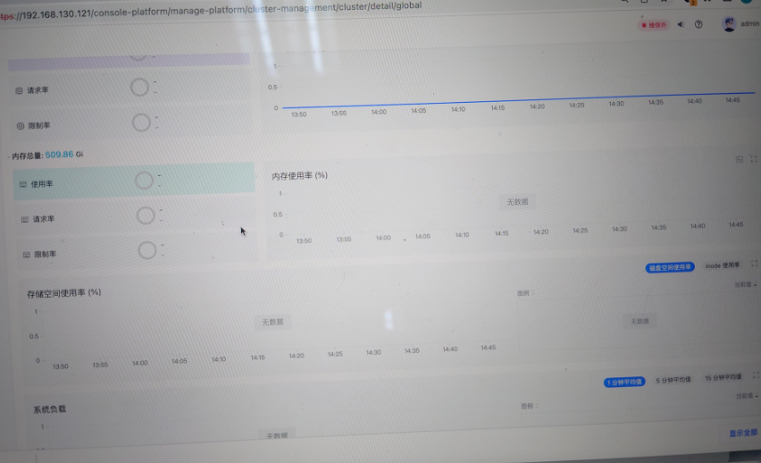
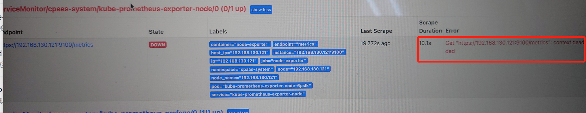

---
kind:
  - Troubleshooting
products:
  - Alauda Container Platform
  - Alauda DevOps
  - Alauda AI
  - Alauda Application Services
  - Alauda Service Mesh
  - Alauda Developer Portal
ProductsVersion:
  - 4.1.0,4.2.x
---
<!-- A type of document that involves encountering a fault, diagnosing it, performing root cause analysis, and providing solutions. -->

# 3.10.2集群节点监控无法展示

监控界面无数据展示 Prometheus targets显示down状态 curl测试/metrics端点响应缓慢（约15秒）

## Cause
- Prometheus数据采集超时
- 集群处于高负载状态

## Resolution
- 修改ServiceMonitor的scrapeTimeout为60s
- 调整抓取间隔为interval: 60s
- 重启prometheus-0实例
- 建议后期优化集群资源使用

## [workaround]
- 临时增加监控抓取超时时间

## [Related Information]
**Screenshots**

- Environment: 3.10.X
- Prometheus-0
- ServiceMonitor
- scrapeTimeout
- /clusters/global/prometheus-0/targets
- /metrics
- kube-prometheus-exporter-node-basic-auth
- Component: Prometheus
- Page ID: 140826001
- Original Title: 3.10.2集群节点监控无法展示
