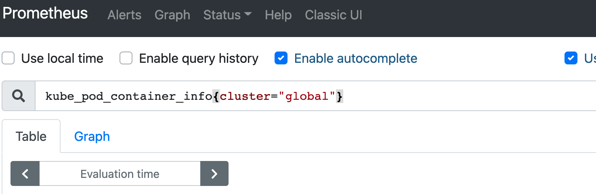

---
kind:
  - Troubleshooting
products:
  - Alauda Container Platform
  - Alauda DevOps
  - Alauda AI
  - Alauda Application Services
  - Alauda Service Mesh
  - Alauda Developer Portal
ProductsVersion:
  - 4.1.0,4.2.x
---
<!-- A type of document that involves encountering a fault, diagnosing it, performing root cause analysis, and providing solutions. -->

# 如何配置prometheus的remotewrite

JIRA Jira：

## Cause
- 第三方Prometheus版本低于v2.25
- 未启用--enable-feature=remote-write-receiver

## Resolution
- 编辑TKE集群Prometheus CR配置: kubectl edit prometheus -n cpaas-system kube-prometheus-0
- 在spec.remoteWrite添加远程写入地址和externalLabels
- 通过第三方Prometheus查询带external label的metrics验证

## [workaround]

## [Related Information]
**Screenshots**

- Environment: 3.10
- prometheus
- remoteWrite
- externalLabels
- http://192.168.18.250/clusters/region-1/prometheus-0/api/v1/write
- kube-prometheus-0
- Component: Prometheus
- Page ID: 144914411
- Original Title: 如何配置prometheus的remotewrite-（远程写入）
