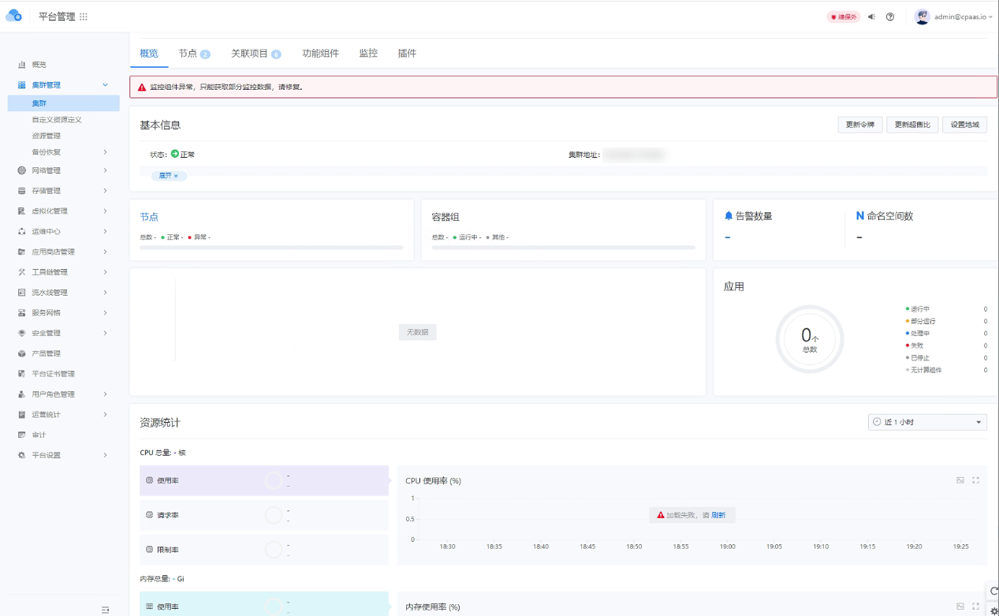

---
kind:
  - Troubleshooting
products:
  - Alauda Container Platform
  - Alauda DevOps
  - Alauda AI
  - Alauda Application Services
  - Alauda Service Mesh
  - Alauda Developer Portal
ProductsVersion:
  - 4.1.0,4.2.x
---
<!-- A type of document that involves encountering a fault, diagnosing it, performing root cause analysis, and providing solutions. -->

# 对接cce公有云，监控部署完之后页面显示异常

页面显示异常 Apollo日志显示请求业务集群监控接口timeout超时 手动请求业务集群11780端口监控数据timeout超时

## Cause
- 管理集群与业务集群11780端口存在网络限制

## Resolution
- 开通防火墙允许管理集群访问业务集群11780端口

## [workaround]

## [Related Information]
**Screenshots**

- Environment: 3.8.2
- 11780端口
- Prometheus ARS
- Apollo日志
- 业务集群监控接口
- Component: Prometheus
- Page ID: 146362297
- Original Title: 对接cce公有云，监控部署完之后页面显示异常
