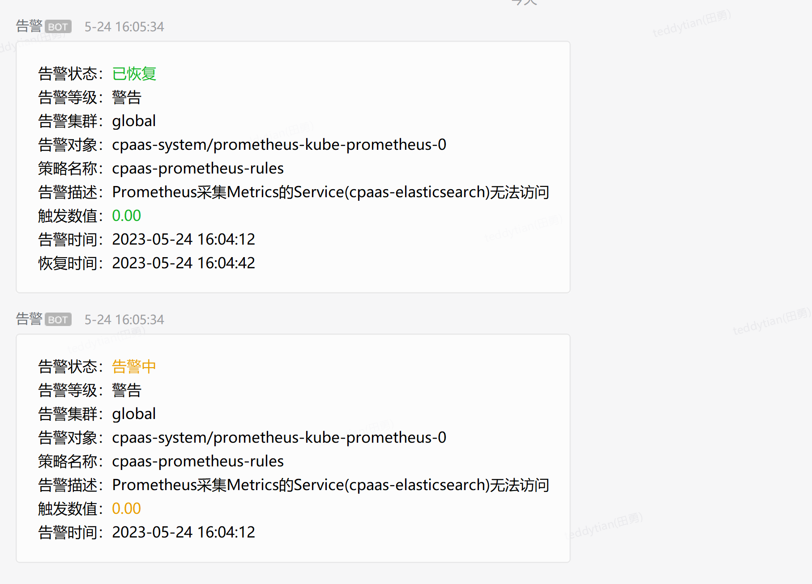
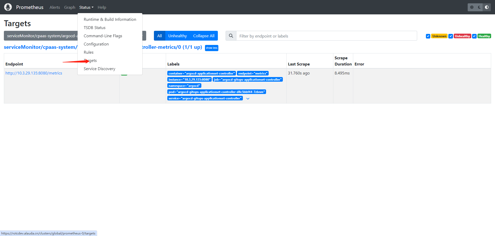
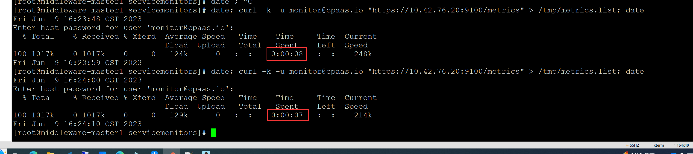
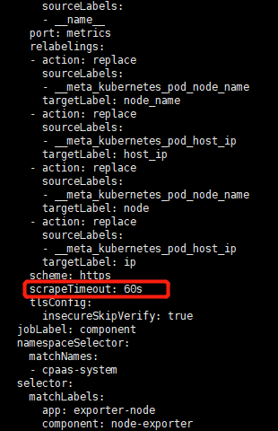

---
kind:
  - Troubleshooting
products:
  - Alauda Container Platform
  - Alauda DevOps
  - Alauda AI
  - Alauda Application Services
  - Alauda Service Mesh
  - Alauda Developer Portal
ProductsVersion:
  - 4.1.0,4.2.x
---
<!-- A type of document that involves encountering a fault, diagnosing it, performing root cause analysis, and providing solutions. -->

# Prometheus获取Metrics的Service的可用性！=1告警

Prometheus触发Metrics采集Service可用性!=1告警 存在context deadline exceeded或timeout报错信息 curl请求时长>10s

## Cause
- Prometheus采集Metrics请求超时

## Resolution
- 修改svcmonitor配置增加scrapeTimeout: 60s

## [workaround]

## [Related Information]
**Screenshots**
例如：

- Environment: 3.6+
- svcmonitor
- Prometheus
- node-exporter
- spec.endpoints.basicAuth
- scrapeTimeout
- Component: Prometheus
- Page ID: 151885719
- Original Title: Prometheus获取Metrics的Service的可用性！=1告警
