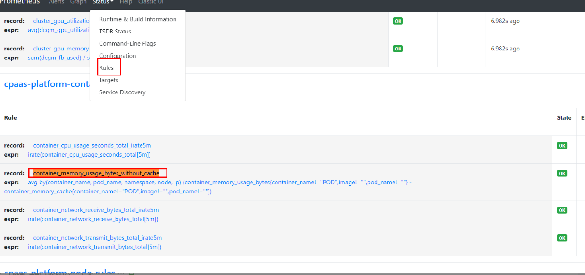

---
kind:
  - Troubleshooting
products:
  - Alauda Container Platform
  - Alauda DevOps
  - Alauda AI
  - Alauda Application Services
  - Alauda Service Mesh
  - Alauda Developer Portal
ProductsVersion:
  - 4.1.0,4.2.x
---
<!-- A type of document that involves encountering a fault, diagnosing it, performing root cause analysis, and providing solutions. -->

# prometheus指标数据

JIRA Jira：

## Cause

## Resolution
- 该指标由Prometheus内置规则生成，通过计算`container_memory_usage_bytes - container_memory_cache`并聚合得出，具体规则定义在Prometheus的`rule`资源中

## [workaround]

## [Related Information]
**Screenshots**

- Environment: 通用
- container_memory_usage_bytes
- container_memory_cache
- serviceMonitor/cpaas-system/kube-prometheus-exporter-kubelets
- rule资源
- Component: Prometheus
- Page ID: 151886445
- Original Title: prometheus指标数据-container_memory_usage_bytes_without_cache这个指标是来自哪个exporter
