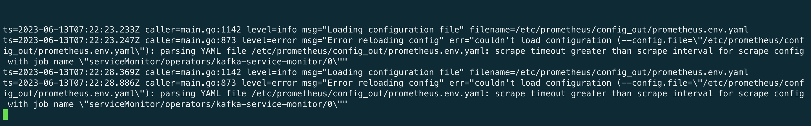

---
kind:
  - Troubleshooting
products:
  - Alauda Container Platform
  - Alauda DevOps
  - Alauda AI
  - Alauda Application Services
  - Alauda Service Mesh
  - Alauda Developer Portal
ProductsVersion:
  - 4.1.0,4.2.x
---
<!-- A type of document that involves encountering a fault, diagnosing it, performing root cause analysis, and providing solutions. -->

# 3.10.2

Prometheus告警最近一次加载配置是否成功 != 1 且持续 1 分钟

## Cause
- kafka servicemonitor的scrapeTimeout时间大于scrape interval时间

## Resolution
- 调低kafka servicemonitor内scrapeTimeout参数

## [workaround]

## [Related Information]
**Screenshots**

- Environment: 3.10.2
- servicemonitor
- scrapeTimeout
- kafka
- prometheus配置加载
- Component: Prometheus
- Page ID: 152633770
- Original Title: 3.10.2-基础架构-Prometheus告警最近一次加载配置是否成功 != 1 且持续 1 分钟
