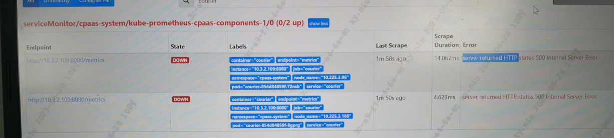

---
kind:
  - Troubleshooting
products:
  - Alauda Container Platform
  - Alauda DevOps
  - Alauda AI
  - Alauda Application Services
  - Alauda Service Mesh
  - Alauda Developer Portal
ProductsVersion:
  - 4.1.0,4.2.x
---
<!-- A type of document that involves encountering a fault, diagnosing it, performing root cause analysis, and providing solutions. -->

# 3.10.2

平台证书管理模块无法看到平台证书信息 巡检功能证书部分无数据 Prometheus缺少cpaas_certificate_expiration_timestamp_seconds指标

## Cause
- certificates资源中存在重复IP记录
- 节点IP变更后未正确清理旧证书资源

## Resolution
- 删除重复的certificates资源
- 重启courier组件

## [workaround]

## [Related Information]
**Screenshots**

- Environment: 3.10.2
- courier组件
- cpaas_certificate_expiration_timestamp_seconds
- certificates资源
- metrics接口
- Component: Prometheus
- Page ID: 152633859
- Original Title: 3.10.2-基础架构-平台证书管理模块无法看到平台证书信息
