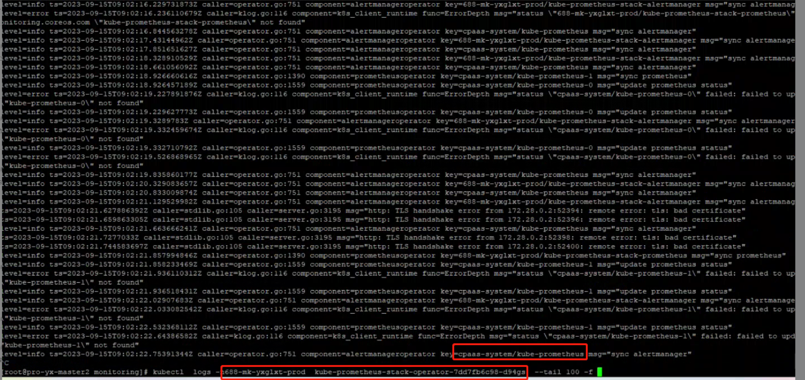

---
kind:
  - Troubleshooting
products:
  - Alauda Container Platform
  - Alauda DevOps
  - Alauda AI
  - Alauda Application Services
  - Alauda Service Mesh
  - Alauda Developer Portal
ProductsVersion:
  - 4.1.0,4.2.x
---
<!-- A type of document that involves encountering a fault, diagnosing it, performing root cause analysis, and providing solutions. -->

# Prometheus 服务pod一直触发删除无法正常运行

Prometheus 服务pod一直触发删除无法正常运行

## Cause
- 存在客户自建Prometheus 监控组件与平台自带Prometheus-operator产生控制器冲突

## Resolution
- 卸载客户自建的测试用Prometheus组件

## [workaround]

## [Related Information]
**Screenshots**

- Environment: 3.12.1版本 cpaas-system命名空间
- Prometheus-operator
- Prometheus
- rpch
- cpaas-system命名空间
- Component: Prometheus
- Page ID: 163067621
- Original Title: Prometheus 服务pod一直触发删除无法正常运行
