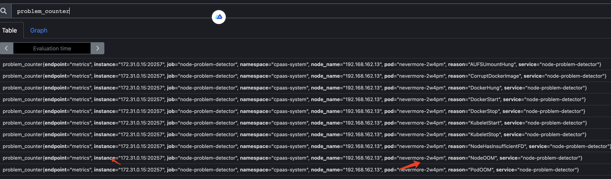

---
kind:
  - Troubleshooting
products:
  - Alauda Container Platform
  - Alauda DevOps
  - Alauda AI
  - Alauda Application Services
  - Alauda Service Mesh
  - Alauda Developer Portal
ProductsVersion:
  - 4.1.0,4.2.x
---
<!-- A type of document that involves encountering a fault, diagnosing it, performing root cause analysis, and providing solutions. -->

# 通知告警传值逻辑

JIRA Jira：

## Cause

## Resolution
- 配置通知模板接口回调使用 `.labels.alert_source` 取值
- 创建告警策略时在告警规则中配置标签/注解，同步到 Prometheus Rules 的 labels/annotation
- 在通知模板中使用 `{{$labels.node_name}}` 和 `{{$labels.pod}}` 格式引用指标字段
- 通过 externallables 字段设置传递自定义告警参数

## [workaround]

## [Related Information]
**Screenshots**

（更新前）
（更新后）

（对应的告警历史查询指标是否传值成功）

- Environment: 3.12.2
- PrometheusRules
- labels
- annotation
- externallables
- 通知模板接口
- alert_source
- alert_project
- Component: Prometheus
- Page ID: 170721836
- Original Title: 通知告警传值逻辑
