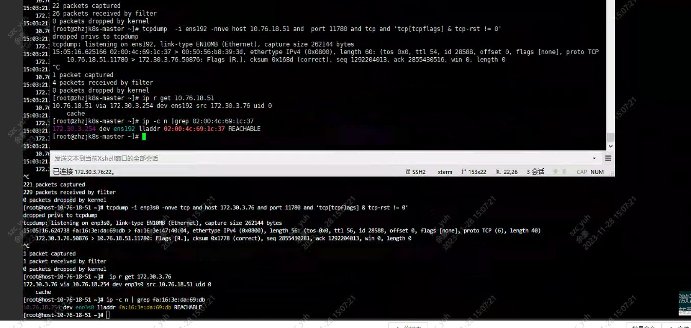
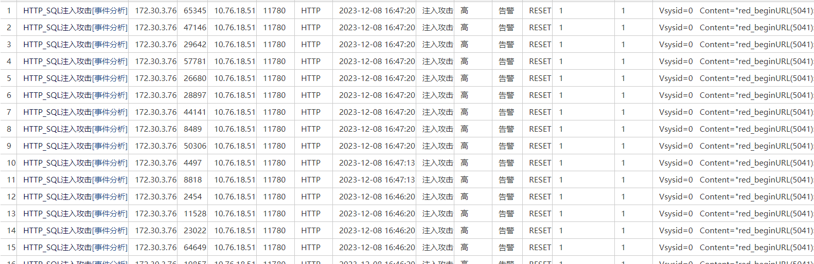

---
kind:
  - Troubleshooting
products:
  - Alauda Container Platform
  - Alauda DevOps
  - Alauda AI
  - Alauda Application Services
  - Alauda Service Mesh
  - Alauda Developer Portal
ProductsVersion:
  - 4.1.0,4.2.x
---
<!-- A type of document that involves encountering a fault, diagnosing it, performing root cause analysis, and providing solutions. -->

# global 访问业务集群 prometheus 出现 connection reset

global 通过业务集群 ALB 访问 prometheus 出现 connection reset 业务集群其他节点访问同一 URL 正常 抓包显示双方均收到对端 TCP RST

## Cause
- 网络路径上的安全软件将 HTTP 请求误判为 SQL 注入

## Resolution
- 将 global 节点 IP 加入安全软件白名单

## [workaround]
- 修改 URL 的 HTTP Query 参数组合

## [Related Information]
**Screenshots**

- Environment: global 与业务集群跨机房部署，通过专线互联，存在防火墙策略
- ALB
- Prometheus
- HTTP Query 参数
- 防火墙规则
- Component: Prometheus
- Page ID: 175276548
- Original Title: global 访问业务集群 prometheus 出现 connection reset
