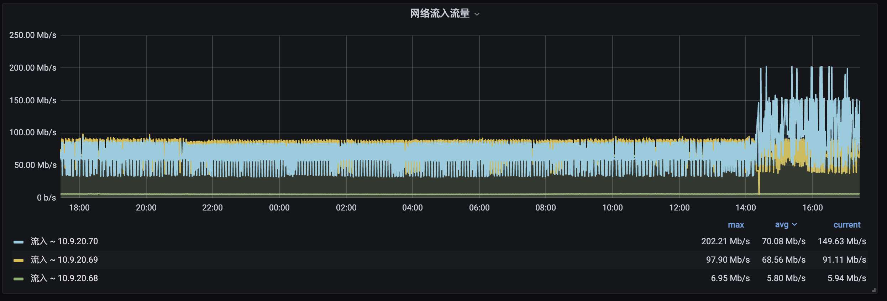
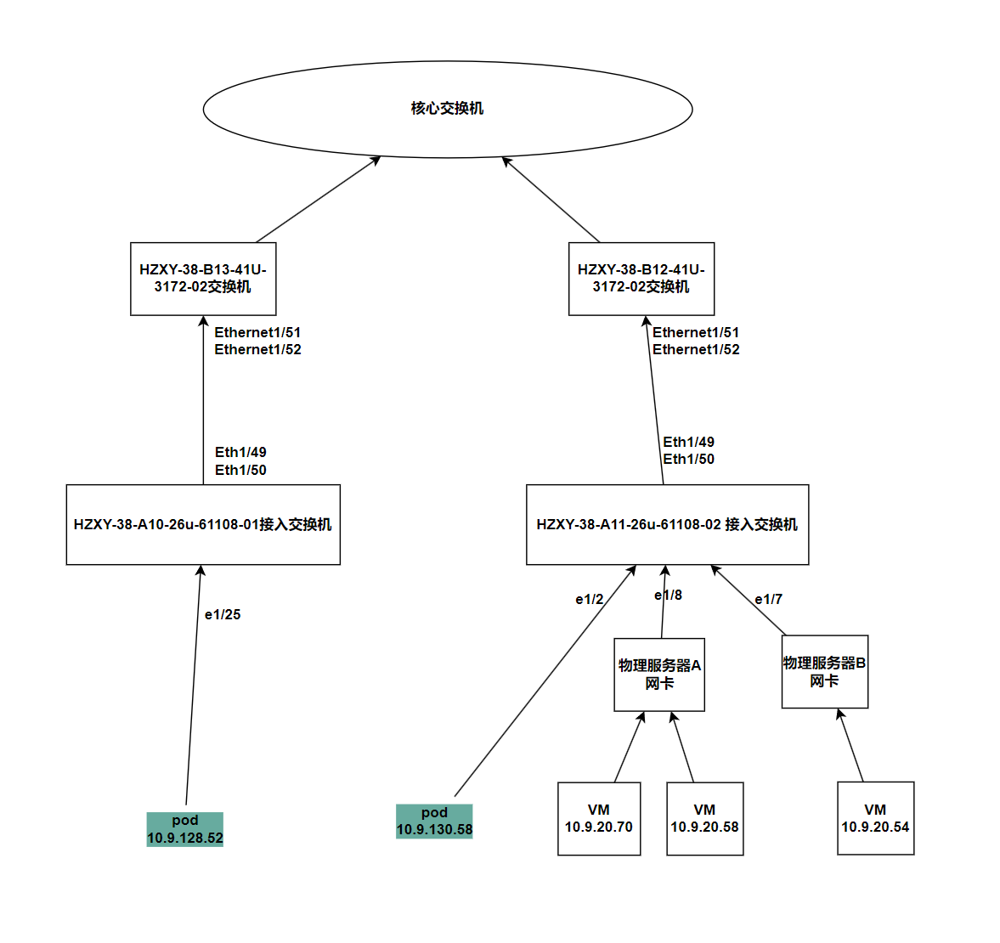

---
kind:
  - Troubleshooting
products:
  - Alauda Container Platform
  - Alauda DevOps
  - Alauda AI
  - Alauda Application Services
  - Alauda Service Mesh
  - Alauda Developer Portal
ProductsVersion:
  - 4.1.0,4.2.x
---
<!-- A type of document that involves encountering a fault, diagnosing it, performing root cause analysis, and providing solutions. -->

# underlay 集群，节点监听到 非该节点上的通信报文

节点上抓到非本节点Pod的通信报文 ALB Pods运行但无端口监听

## Cause
- vswitch开启了混杂模式

## Resolution
- 检查并关闭vswitch的混杂模式

## [workaround]

## [Related Information]
**Screenshots**

- Environment: ACP3.12.2
- vswitch
- OVN underlay网络
- ALB Pods
- Prometheus
- Component: Prometheus
- Page ID: 225971433
- Original Title: underlay 集群，节点监听到 非该节点上的通信报文
